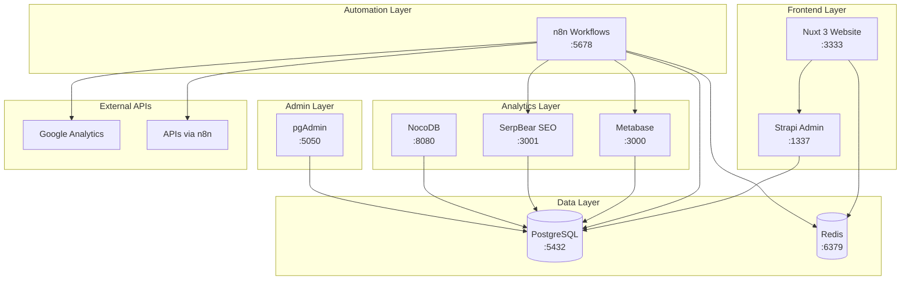
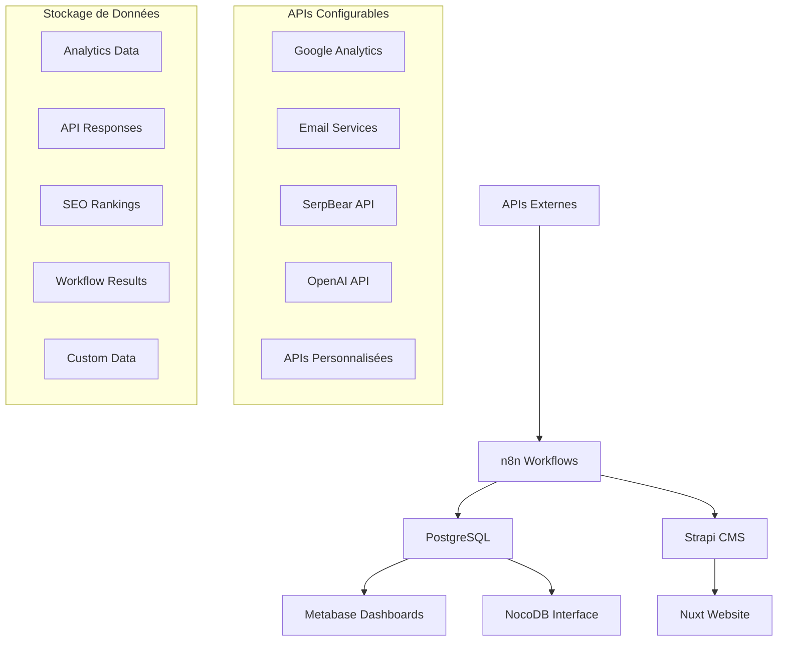

# 🚀 Strapi Automation Starter

**Site web d'entreprise moderne avec CMS headless et outils d'administration**

Cette plateforme permet de créer rapidement un site web d'entreprise moderne basé sur Nuxt 3 et Strapi, avec des outils d'administration, d'analytics et d'automatisation. Idéale pour les entreprises qui souhaitent un site performant avec un CMS flexible et des capacités d'extension via n8n.

## 📋 Table des Matières

- [🎯 Vue d'Ensemble](#-vue-densemble)
- [🏗️ Architecture Technique](#️-architecture-technique)
- [🔧 Services Inclus](#-services-inclus)
- [🔄 Workflows Automatisés](#-workflows-automatisés)
- [🔗 Interconnexions et APIs](#-interconnexions-et-apis)
- [🚀 Installation Rapide](#-installation-rapide)
- [⚙️ Configuration](#️-configuration)
- [📊 Analytics et Reporting](#-analytics-et-reporting)
- [🤖 Intelligence Artificielle](#-intelligence-artificielle)
- [📈 SEO et Marketing](#-seo-et-marketing)
- [🛡️ Sécurité et Monitoring](#️-sécurité-et-monitoring)
- [🔧 Administration](#-administration)
- [📋 Cas d'Usage](#-cas-dusage)
- [🆘 Dépannage](#-dépannage)

## 🎯 Vue d'Ensemble

### Concept

Cette plateforme permet de **créer des sites web d'entreprise modernes** avec un CMS headless Strapi et un écosystème d'outils d'administration et d'analyse. Chaque déploiement crée un site Nuxt 3 performant, alimenté par un CMS Strapi, avec des workflows n8n pour les automatisations :

- ✅ **Site web d'entreprise** moderne et performant avec blog
- ✅ **CMS headless** pour la gestion de contenu
- ✅ **Analytics** avec Google Analytics et Metabase
- ✅ **Suivi SEO** avec SerpBear
- ✅ **Workflows d'automatisation** via n8n
- ✅ **Base de données centralisée** PostgreSQL avec interfaces d'administration

### Philosophie

**"Simplicité et performance"** - Chaque instance de cette plateforme est un site web d'entreprise moderne qui :

1. 🎨 **Affiche du contenu** géré via le CMS Strapi
2. 📊 **Collecte des analytics** avec Google Analytics
3. 🔍 **Suit son positionnement SEO** via SerpBear
4. 🔧 **Permet l'administration** des données via des interfaces dédiées
5. 🤖 **Offre des automatisations** via n8n pour les intégrations tierces
6. 📈 **Génère des rapports** visuels avec Metabase
3. 🔍 **Monitorer le SEO** et alerter sur les changements
4. 📧 **Gérer les campagnes email** et leur performance
5. 🌐 **Surveiller la disponibilité** des services
6. 📈 **Générer des rapports** visuels automatiques

## 🏗️ Architecture Technique



### Stack Technologique

| **Couche** | **Technologies** | **Rôle** |
|------------|------------------|----------|
| **Frontend** | Nuxt 3, Vue.js, TypeScript | Sites web d'entreprise performants |
| **Backend** | Strapi, Node.js | CMS headless et API REST/GraphQL |
| **Base de Données** | PostgreSQL 15, Redis 7 | Stockage principal et cache |
| **Automatisation** | n8n, Workflows JSON | Automatisations et intégrations configurables |
| **Analytics** | Metabase, Google Analytics | Visualisation et suivi des performances |
| **SEO** | SerpBear | Suivi de positionnement |
| **Administration** | pgAdmin, NocoDB | Interfaces de gestion des données |
| **Orchestration** | Docker Compose | Déploiement et conteneurisation |

## 🔧 Services Inclus

### 🌐 Nuxt 3 Website (`website:3000` → `:3333`)
**Site web d'entreprise moderne avec stack technologique avancé**

**🚀 Technologies de pointe intégrées :**
- **Nuxt 3.17.5** : Framework Vue.js full-stack avec SSR/SSG
- **Vue 3.5.16** + **TypeScript** : Développement moderne et typé
- **TailwindCSS 4.1.3** avec **@tailwindcss/vite** : Design system modulaire
- **GSAP** : Animations fluides et performantes
- **ESLint 9.0** : Qualité de code garantie

**🔍 SEO et référencement optimisé :**
- 🔥 **Server-Side Rendering (SSR)** pour indexation parfaite
- ⚡ **Static Site Generation (SSG)** avec pré-rendu intelligent
- 🤖 **JSON-LD structuré** via `nuxt-jsonld` pour le référencement IA
- 📊 **Google Analytics 4** avec `nuxt-gtag` intégré
- 🔍 **Meta-tags dynamiques** générés automatiquement
- 📱 **Core Web Vitals** optimisés avec compression automatique
- 🗺️ **Sitemap XML** et robots.txt automatiques

**🎨 Interface utilisateur moderne :**
- 📱 **Design responsive** avec TailwindCSS 4
- ✨ **Animations GSAP** pour l'engagement utilisateur
- 🖼️ **Optimisation d'images** avec `@nuxt/image`
- 🔤 **Gestion des polices** avec `@nuxt/fonts`
- 🎯 **Icônes** vectorielles avec `@nuxt/icon`
- 🌐 **PWA-ready** avec manifeste automatique

**🔗 Intégrations et APIs :**
- 📡 **Strapi CMS** via API REST/GraphQL
- 📊 **Google Analytics 4** tracking avancé
- 🔐 **Session management** sécurisé côté serveur
- 🔗 **Scripts tiers** optimisés avec `@nuxt/scripts`
- 🧪 **Tests automatisés** avec `@nuxt/test-utils`

**🚀 Performances et optimisations :**
- 📦 **Compression automatique** des assets
- 🗂️ **Code splitting** intelligent
- 💾 **Cache optimisé** avec stratégies adaptatives
- ⚡ **Hydration selective** pour temps de chargement minimal
- 🔄 **Hot reload** en développement

**Variables d'environnement (.env) :**
```bash
# Configuration essentielle du site web
STRAPI_URL=http://strapi:1337              # URL du CMS Strapi
STRAPI_API_TOKEN=your_strapi_api_token     # Token d'accès Strapi
SESSION_SECRET=your_secure_session_secret   # Clé sessions sécurisées

# Analytics (optionnel)
GOOGLE_ANALYTICS_PROPERTY_ID=123456789     # Google Analytics 4
GOOGLE_TAG=G-XXXXXXXXXX                    # Alternative Google Tag

# Configuration générale
NODE_ENV=development                        # Environment
```

**Exemple d'utilisation JSON-LD pour l'IA :**
```typescript
// Données structurées automatiques pour référencement IA
export default {
  '@context': 'https://schema.org',
  '@type': 'Organization',
  name: 'Votre Entreprise',
  url: 'https://votre-site.com',
  description: 'Description optimisée pour l\'IA',
  sameAs: ['https://linkedin.com/company/...']
}
```

**🎨 Animations et Interactivité GSAP :**
```typescript
// plugins/gsap.client.ts - Animations fluides
import { gsap } from 'gsap'
import { ScrollTrigger } from 'gsap/ScrollTrigger'

export default defineNuxtPlugin(() => {
  gsap.registerPlugin(ScrollTrigger)
  
  // Animations au scroll pour engagement utilisateur
  gsap.from('.hero-title', {
    duration: 1,
    y: 100,
    opacity: 0,
    ease: 'power2.out'
  })
  
  // Animations de cartes au survol
  gsap.set('.card', {
    transformOrigin: 'center center'
  })
})
```

**Types d'animations disponibles :**
- ✨ **Hero sections** avec effets parallax
- 🏃 **Animations au scroll** (ScrollTrigger)
- 🃏 **Hover effects** sur boutons/cartes
- 📄 **Transitions de pages** fluides
- 🎯 **Call-to-action** animés pour conversion
- 📱 **Animations responsive** optimisées mobile

---

### 📝 Strapi CMS (`strapi:1337`)
**CMS headless puissant et extensible**

**Fonctionnalités :**
- 🎛️ **Interface d'administration** intuitive
- 🔧 **Content Types** flexibles et personnalisables
- 🔐 **Système d'authentification** et rôles utilisateurs
- 📡 **API REST & GraphQL** auto-générées
- 🔌 **Plugins** et extensions personnalisées
- 📂 **Gestion des médias** avec optimisation d'images
- 🌍 **Internationalisation** native

**Base de données dédiée :**
```sql
-- Database: strapi_cms
-- Tables principales :
- strapi_core_store_settings
- up_users (utilisateurs)
- up_permissions_role
- files (médias)
- [custom_content_types] (vos types de contenu)
```

**Configuration avancée :**
- Cache Redis intégré pour les performances
- Compression et optimisation automatiques
- Webhooks pour synchroniser avec n8n
- Backup automatique des contenus

---

### 🤖 n8n Automation (`n8n:5678`)
**Plateforme d'automatisation pour intégrations tierces**

n8n vous permet de créer des workflows d'automatisation pour connecter votre site aux services externes. Configurez facilement vos intégrations via l'interface graphique sans avoir besoin de gérer des variables d'environnement complexes.

**Fonctionnalités principales :**
- 🔗 **Interface graphique** pour créer des workflows
- 🔐 **Gestion centralisée** des credentials API
- ⏰ **Planification** de tâches automatiques
- 📊 **Collecte de données** depuis services externes
- 💾 **Stockage** des résultats en base PostgreSQL

**Configuration des intégrations :**
Toutes les APIs tierces (OpenAI, Brevo, réseaux sociaux, etc.) se configurent directement dans n8n via l'interface Credentials, ce qui sépare clairement la configuration du site web et les automatisations.

**Exemples d'usage :**
- Génération de contenu avec OpenAI
- Envoi d'emails marketing via Brevo
- Collecte d'analytics Google
- Suivi SEO automatisé
- Monitoring de disponibilité

---

### 🗄️ PostgreSQL (`postgres:5432`)
**Base de données principale avec bases spécialisées**

#### Structure des bases :

```sql
-- 1. strapi_cms (contenu et API)
CREATE DATABASE strapi_cms;

-- 2. nocodb_app (interface no-code)
CREATE DATABASE nocodb_app;

-- 3. n8n_workflows (workflows et historique)
CREATE DATABASE n8n_workflows;

-- 4. metabase_analytics (configuration dashboards)
CREATE DATABASE metabase_analytics;

-- 5. serpbear_seo (données SEO)
CREATE DATABASE serpbear_seo;
```

#### Utilisation par service :

- **Strapi CMS** : Stockage du contenu, médias, utilisateurs
- **n8n** : Historique des workflows et configurations
- **Metabase** : Configuration des dashboards et rapports
- **SerpBear** : Suivi des positions SEO
- **NocoDB** : Interface d'administration des données

#### Tables automatiques créées par les services :
```sql
-- Exemples de tables selon vos workflows n8n
CREATE TABLE workflow_results (
  id SERIAL PRIMARY KEY,
  workflow_name VARCHAR,
  execution_date TIMESTAMP,
  data JSONB,
  status VARCHAR
);
```

---

### 🚀 Redis (`redis:6379`)
**Cache haute performance et sessions**

**Utilisations :**
- 🔄 **Cache Strapi** : Contenu, requêtes API, sessions admin
- ⚡ **Cache général** : Données fréquemment utilisées
- 🤖 **Support n8n** : États temporaires des workflows
- 🌐 **Sessions website** : Gestion des sessions utilisateur

---

### 📊 Metabase (`metabase:3000`)
**Plateforme d'analytics et dashboards**

#### Dashboards configurables :

1. **📈 Business Overview**
   - Évolution du trafic web
   - Performance générale du site
   - Métriques personnalisées
   - Données issues de vos workflows n8n

2. **🔍 SEO Performance**
   - Suivi des mots-clés (SerpBear)
   - Évolution des positions
   - Opportunités d'amélioration
   - Corrélations trafic/positions

3. **📊 Données Personnalisées**
   - Données collectées via n8n
   - Métriques métier spécifiques
   - Tableaux de bord sur mesure
   - Rapports automatisés

4. **🛡️ Infrastructure Monitoring**
   - Disponibilité des services
   - Temps de réponse
   - Alertes et incidents
   - Performance globale

**Configuration flexible :**
- Connexion PostgreSQL préconfigurée
- Dashboards adaptables selon vos besoins
- Export PDF/CSV programmé
- Intégration avec vos workflows n8n

---

### 🔍 SerpBear (`serpbear:3001`)
**Suivi de positionnement SEO professionnel**

**Fonctionnalités avancées :**
- 🎯 **Suivi multi-mots-clés** illimité
- 🌍 **Géolocalisation** des recherches (France, international)
- 📱 **Desktop & Mobile** séparément
- 📊 **Historique complet** des positions
- ⚠️ **Alertes** email/webhook
- 🔄 **API REST** pour intégrations n8n
- 📈 **Graphiques d'évolution** temps réel

**Configuration API :**
```bash
# Génération de la clé API dans l'interface SerpBear
SERPBEAR_API_KEY=your_generated_api_key

# Endpoints disponibles :
GET /api/keywords - Liste tous les mots-clés
GET /api/keywords/{id} - Détails d'un mot-clé
POST /api/keywords - Ajouter un mot-clé
PUT /api/keywords/{id} - Modifier un mot-clé
DELETE /api/keywords/{id} - Supprimer un mot-clé
```

---

### 🗄️ NocoDB (`nocodb:8080`)
**Interface no-code pour bases de données**

**Avantages pour les non-techniques :**
- 📊 **Interface type Airtable** pour PostgreSQL
- 🔗 **Formulaires** de saisie automatiques
- 📈 **Vues personnalisées** (calendrier, kanban, galerie)
- 🔍 **Filtres et tri** avancés
- 📱 **API REST automatique** générée
- 👥 **Partage et collaboration**
- 🔗 **Webhooks** pour intégrations

**Cas d'usage :**
- ✏️ **Gestion du contenu** Strapi sans technique
- 📊 **Visualisation des données** collectées par n8n
- 📝 **Saisie manuelle** de données personnalisées
- 🎯 **Gestion des mots-clés** SEO
- 👥 **Base de contacts** et données métier
- 📋 **Todo lists** et gestion de projets

**Configuration :**
- Base PostgreSQL partagée
- Redis pour le cache
- Authentification JWT
- Connexion directe aux tables de données

---

### 🛠️ pgAdmin (`pgadmin:5050`)
**Interface d'administration PostgreSQL**

**Fonctionnalités :**
- 🗄️ **Exploration** de toutes les bases
- ✏️ **Éditeur SQL** avancé avec syntax highlighting
- 📊 **Monitoring** performance et requêtes
- 🔧 **Gestion des utilisateurs** et permissions
- 📁 **Import/Export** données (CSV, JSON, SQL)
- 🔍 **Analyseur de requêtes** et optimisation
- 📈 **Statistiques** d'utilisation des tables

**Accès pré-configuré :**
- Toutes les 6 databases connectées
- Utilisateur admin configuré
- Dashboards de monitoring inclus

## 🔄 Workflows Configurables

### 🕐 Exemple de Planning d'Exécution

```mermaid
gantt
    title Workflows Flexibles (Configurables selon vos besoins)
    dateFormat  HH:mm
    axisFormat %H:%M

    section Quotidien
    Data Collection      :03:00, 30m
    Content Sync         :05:00, 45m
    
    section Continu
    Website Monitoring   :00:00, 24h
    API Webhooks        :00:00, 24h
    
    section Hebdomadaire
    Analytics Reports    :crit, 09:00, 2h
```



### 🔄 Flux de Données Flexible



### 📊 Métriques Configurables

| **Type de Données** | **Fréquence** | **Source** | **Automatisation Possible** |
|---------------------|---------------|------------|------------------------------|
| **Trafic Web** | Configurable | Google Analytics | Alertes personnalisées |
| **Positions SEO** | Quotidien | SerpBear | Notifications de changements |
| **Données API** | Temps réel | APIs diverses | Traitement automatique |
| **Monitoring Services** | 15 min | Workflows n8n | Notifications d'incidents |
| **Données Métier** | Personnalisable | APIs configurées | Actions selon vos règles |

## 🔗 Interconnexions et APIs

### 🌐 Configuration des intégrations

#### Site Web (Nuxt)
```bash
# Variables essentielles pour le site
STRAPI_URL=http://strapi:1337
STRAPI_API_TOKEN=your_strapi_api_token
GOOGLE_ANALYTICS_PROPERTY_ID=123456789  # Optionnel
SESSION_SECRET=your_secure_session_secret
```

#### Workflows n8n
**Toutes les APIs tierces sont configurées dans n8n via l'interface Credentials :**

- **Google Analytics** : pour récupérer les données de trafic
- **OpenAI** : pour génération de contenu IA
- **Brevo** : pour email marketing et newsletters  
- **Réseaux sociaux** : Facebook, LinkedIn, Instagram
- **APIs diverses** : selon vos besoins d'automatisation

#### Avantages de cette approche
```bash
# ✅ Sécurité renforcée : credentials centralisés dans n8n
# ✅ Flexibilité : ajout/suppression facile d'APIs
# ✅ Maintenance simplifiée : configuration via interface
# ✅ Séparation des responsabilités : site web vs automatisations
```

### 🔌 APIs Internes

#### Strapi CMS API
```javascript
// REST API
GET    /api/articles
POST   /api/articles
PUT    /api/articles/:id
DELETE /api/articles/:id

// GraphQL endpoint
POST   /graphql

// Webhooks Strapi vers n8n
POST   /webhook/strapi-content-updated
POST   /webhook/strapi-user-registered
```

#### n8n Webhooks
```javascript
// Brevo Email Events
POST /webhook/brevo-webhook

// Monitoring Alerts
POST /webhook/monitoring-alert

// Custom Triggers
POST /webhook/custom-trigger/:workflow_id
```

#### SerpBear API
```javascript
// API REST complète
GET    /api/keywords
POST   /api/keywords
PUT    /api/keywords/:id
DELETE /api/keywords/:id
GET    /api/domains
GET    /api/results/:keyword_id
```

### 🔄 Synchronisation des Données

#### Workflow de Synchronisation Temps Réel


## 🚀 Installation Rapide

### Prérequis

- 🐳 **Docker** et **Docker Compose** installés
- 🔧 **8 GB RAM** minimum recommandé
- 💾 **20 GB d'espace disque** libre
- 🌐 **Accès internet** pour les APIs externes

### Installation en 5 Minutes

```bash
# 1. Cloner le repository
git clone https://github.com/your-repo/strapi-automation-starter.git
cd strapi-automation-starter

# 2. Copier et configurer l'environnement
cp .env.example .env
nano .env  # Éditer les mots de passe et clés nécessaires

# 3. Lancer tous les services
docker compose up -d

# 4. Vérifier le déploiement
docker compose ps
```

### Vérification de l'Installation

Attendez 2-3 minutes puis vérifiez les services :

```bash
# Services opérationnels
curl http://localhost:3333  # Nuxt Website
curl http://localhost:1337  # Strapi CMS
curl http://localhost:5678  # n8n Workflows
curl http://localhost:3000  # Metabase
curl http://localhost:3001  # SerpBear
curl http://localhost:8080  # NocoDB
curl http://localhost:5050  # pgAdmin
```

### Accès aux Interfaces

| **Service** | **URL** | **Identifiants par défaut** |
|-------------|---------|------------------------------|
| 🌐 **Website** | http://localhost:3333 | - (public) |
| 📝 **Strapi Admin** | http://localhost:1337/admin | (créer lors du 1er accès) |
| 🤖 **n8n** | http://localhost:5678 | admin / (voir .env) |
| 📊 **Metabase** | http://localhost:3000 | (configuration au 1er accès) |
| 🔍 **SerpBear** | http://localhost:3001 | (créer compte au 1er accès) |
| 🗄️ **NocoDB** | http://localhost:8080 | (créer au 1er accès) |
| 🛠️ **pgAdmin** | http://localhost:5050 | admin@votre-domaine.com / (voir .env) |

## ⚙️ Configuration

### 🔐 Variables d'Environnement Essentielles

#### 1. Configuration .env Principale

**Variables obligatoires (à modifier en production) :**
```bash
# =============================================================================
# PostgreSQL - Base de données principale
# =============================================================================
POSTGRES_DB=automation_hub                              # Base de données principale
POSTGRES_USER=admin_user                                # Utilisateur PostgreSQL
POSTGRES_PASSWORD=your_super_secure_password_2024!      # ⚠️ À CHANGER en production

# Bases spécialisées par service
STRAPI_DB_NAME=strapi_cms                               # CMS Strapi
NOCODB_DB_NAME=nocodb_app                               # Interface NocoDB
N8N_DB_NAME=n8n_workflows                               # Workflows n8n
METABASE_DB_NAME=metabase_analytics                     # Analytics Metabase
SERPBEAR_DB_NAME=serpbear_seo                           # SEO SerpBear

# =============================================================================
# Strapi CMS - Clés de sécurité
# =============================================================================
STRAPI_APP_KEYS=NrXnjEMSjK5WRTKS2E1Rjg==,0oQaqHfIzUk14vAW7+G8/w==...
STRAPI_JWT_SECRET=sUPfbO9brnOJ0r078Jw35A==            # ⚠️ À CHANGER
STRAPI_ADMIN_JWT_SECRET=sUPfbO9brnOJ0r078Jw35A==       # ⚠️ À CHANGER
STRAPI_API_TOKEN=your_strapi_api_token_for_nuxt_website # Pour connexion Nuxt

# =============================================================================
# Services - Sécurité et accès
# =============================================================================
# n8n Automation
N8N_BASIC_AUTH_USER=admin                               # Login n8n
N8N_BASIC_AUTH_PASSWORD=CHANGEZ_MOI_n8n_secure_password_2024!
N8N_ENCRYPTION_KEY=CHANGEZ_MOI_n8n_encryption_key_very_long_and_secure_2024

# NocoDB Interface
NC_AUTH_JWT_SECRET=CHANGEZ_MOI_nocodb_jwt_secret_very_long_and_secure_2024

# Metabase Analytics
METABASE_ENCRYPTION_KEY=CHANGEZ_MOI_metabase_encryption_key_very_long_and_secure_2024

# SerpBear SEO
SERPBEAR_NEXTAUTH_SECRET=CHANGEZ_MOI_serpbear_nextauth_secret_very_long_and_secure_2024

# pgAdmin
PGADMIN_EMAIL=admin@votre-domaine.com                   # Email connexion pgAdmin
PGADMIN_PASSWORD=admin_secure_password_2024!            # ⚠️ À CHANGER

# =============================================================================
# Analytics (Optionnel) - Site web uniquement
# =============================================================================
GOOGLE_ANALYTICS_PROPERTY_ID=123456789                  # GA4 Property ID
```

#### 2. Google Analytics Setup (Optionnel)

```bash
# 1. Google Analytics 4
# - Créer une propriété GA4 sur https://analytics.google.com
# - Récupérer l'ID de propriété (ex: 123456789)
# - Ajouter dans .env : GOOGLE_ANALYTICS_PROPERTY_ID=123456789

# 2. Pour automatisations n8n avancées (optionnel)
# - Google Cloud Console → APIs → Google Analytics Data API
# - Créer des credentials OAuth2
# - Configurer dans n8n → Credentials → Google Analytics
```

#### 3. Configuration des APIs tierces via n8n

**🔑 Principe de séparation des responsabilités :**
- ✅ **Site web** : Variables .env minimales (Strapi + Analytics)
- ✅ **Automatisations** : APIs tierces configurées dans n8n
- ✅ **Sécurité** : Credentials centralisés et chiffrés

**APIs configurables dans n8n :**
```bash
# Accéder à n8n : http://localhost:5678
# → Credentials → Add Credential

# Exemples d'intégrations possibles :
- OpenAI API (génération de contenu IA)
- Brevo / SendinBlue (email marketing)
- Google APIs (Drive, Sheets, Calendar)
- Réseaux sociaux (Facebook, LinkedIn, Twitter)
- CRM (HubSpot, Salesforce, Pipedrive)
- E-commerce (Shopify, WooCommerce)
- Et bien d'autres via les 400+ nodes n8n
```

#### 4. Configuration Strapi CMS

```bash
# 1. Premier accès
# → http://localhost:1337/admin
# → Créer compte administrateur

# 2. Générer token API pour Nuxt
# → Paramètres → API Tokens → Create new API Token
# → Type : Read-only ou Full access
# → Copier le token dans .env :
STRAPI_API_TOKEN=votre_token_généré

# 3. Configuration des Content Types
# → Content-Type Builder → Créer vos types de contenu
# → Settings → Users & Permissions → Configurer accès public
```

### 🔧 Configuration Avancée

#### Customisation des Workflows

```bash
# Éditer les workflows n8n
cd n8n/workflows/

# Modifier les fréquences
nano ai-content-analysis.json
# Changer "0 9 * * 1" pour une autre planification

# Ajouter des intégrations
# Les workflows sont en JSON, modifiables via interface n8n
```

#### Optimisation Performance

```yaml
# docker compose.override.yml
version: '3.8'
services:
  postgres:
    command: >
      postgres
      -c shared_preload_libraries=pg_stat_statements
      -c pg_stat_statements.max=10000
      -c pg_stat_statements.track=all
    
  redis:
    command: redis-server --maxmemory 512mb --maxmemory-policy allkeys-lru
```

#### Configuration SSL/HTTPS

```nginx
# nginx.conf (pour production)
server {
    listen 443 ssl;
    server_name your-domain.com;
    
    ssl_certificate /path/to/cert.pem;
    ssl_certificate_key /path/to/key.pem;
    
    location / {
        proxy_pass http://localhost:3333;
        proxy_set_header Host $host;
        proxy_set_header X-Real-IP $remote_addr;
    }
    
    location /admin {
        proxy_pass http://localhost:1337;
    }
    
    location /n8n {
        proxy_pass http://localhost:5678;
    }
}
```

## 📊 Analytics et Reporting

### 📈 Dashboards Metabase

#### 1. Dashboard Principal

**Métriques affichées selon vos besoins :**
- 📊 **Trafic** : Sessions, utilisateurs, pages vues
- 🔍 **SEO** : Positions des mots-clés, évolutions
- 📈 **Performance** : Métriques personnalisées
- 💾 **Données** : Collectées via vos workflows n8n
- 🎯 **Objectifs** : KPIs définis selon votre activité

**Requêtes SQL exemple :**
```sql
-- Evolution du trafic (si Google Analytics configuré)
SELECT 
  date_collected,
  SUM(sessions) as total_sessions,
  SUM(users) as total_users
FROM workflow_results 
WHERE workflow_name = 'google_analytics_data'
  AND execution_date >= CURRENT_DATE - INTERVAL '30 days'
GROUP BY date_collected
ORDER BY date_collected;

-- Top mots-clés SEO (depuis SerpBear)
SELECT 
  keyword,
  AVG(position) as avg_position,
  COUNT(*) as tracking_days
FROM serpbear_rankings 
WHERE date_collected >= CURRENT_DATE - INTERVAL '30 days'
  AND position <= 10
GROUP BY keyword
ORDER BY avg_position ASC
LIMIT 10;
```

#### 2. Dashboard SEO

**Widgets spécialisés :**
- 🎯 **Mots-clés performants** (progressions)
- ⚠️ **Alertes SEO** (chutes de positions)
- 📊 **Distribution positions** (top 3, 4-10, 11-20, etc.)
- 🔍 **Opportunités** (mots-clés à améliorer)
- 📈 **Corrélations** trafic/positions

#### 3. Dashboard Données Personnalisées

**Métriques selon vos workflows :**
- 📧 **Données email** (si configuré via n8n)
- 🎯 **Conversions** et objectifs métier
- ⏰ **Performance temporelle** des actions
- 📱 **Données multi-sources** agrégées
- 🔄 **Suivi des automatisations**

#### 4. Dashboard Techniques

**Suivi des workflows et système :**
- 💡 **Exécutions n8n** et statuts
- 📊 **Performance base de données**
- 🎯 **ROI des suggestions** implémentées
- 🔄 **Amélioration continue** du modèle IA

### 📋 Rapports Automatisés

#### Rapport Hebdomadaire PDF

- 🛡️ **Monitoring système** et alertes
- 💾 **Sauvegarde** automatique des données

## 🤖 Intelligence Artificielle (Configurable)

### 🧠 Intégrations IA via n8n

L'intelligence artificielle est entièrement configurable via n8n selon vos besoins spécifiques.

**Exemples d'utilisation possibles :**
- 🤖 **Génération de contenu** avec OpenAI
- 📊 **Analyse de données** personnalisée
- 🔍 **Optimisation SEO** automatique
- 📧 **Personnalisation emails** selon les profils
- 📱 **Suggestions de contenu** pour réseaux sociaux

**Configuration :**
```javascript
// Exemple de workflow n8n avec OpenAI
{
  "nodes": [
    {
      "name": "Trigger",
      "type": "n8n-nodes-base.webhook"
    },
    {
      "name": "OpenAI",
      "type": "n8n-nodes-base.openAi",
      "credentials": "openAiApi"
    },
    {
      "name": "Save to Database",
      "type": "n8n-nodes-base.postgres"
    }
  ]
}
```

**Avantages de cette approche :**
- ✅ **Flexibilité maximale** : configurez uniquement ce dont vous avez besoin
- ✅ **Évolutivité** : ajoutez des fonctionnalités IA au fur et à mesure
- ✅ **Coûts maîtrisés** : payez uniquement les APIs que vous utilisez
- ✅ **Sécurité** : credentials centralisés dans n8n

## 📈 SEO et Analytics

### 🤖 SEO Moderne et Référencement IA

#### JSON-LD et Données Structurées

**🧠 Optimisation pour l'intelligence artificielle :**
Le package `nuxt-jsonld` permet d'intégrer automatiquement des **données structurées Schema.org** optimisées pour les moteurs de recherche et l'IA (ChatGPT, Gemini, etc.).

```typescript
// Exemple d'implémentation JSON-LD pour une organisation
export default defineNuxtPlugin(() => {
  useJsonld(() => ({
    '@context': 'https://schema.org',
    '@type': 'Organization',
    name: 'Votre Entreprise',
    url: 'https://votre-site.com',
    logo: 'https://votre-site.com/logo.png',
    description: 'Description claire et concise pour les IA',
    address: {
      '@type': 'PostalAddress',
      streetAddress: '123 Rue Example',
      addressLocality: 'Paris',
      postalCode: '75001',
      addressCountry: 'FR'
    },
    contactPoint: {
      '@type': 'ContactPoint',
      telephone: '+33-1-23-45-67-89',
      contactType: 'Service client'
    },
    sameAs: [
      'https://www.linkedin.com/company/votre-entreprise',
      'https://twitter.com/votre_entreprise'
    ]
  }))
})
```

**🔍 Types de contenus structurés supportés :**
- 🏢 **Organization** : Informations entreprise
- 📄 **Article** : Articles de blog SEO-optimisés
- 🛒 **Product** : Fiches produits e-commerce
- 👤 **Person** : Profils équipe et dirigeants
- 📍 **LocalBusiness** : Entreprises locales
- ❓ **FAQPage** : Pages de questions-réponses
- 🍞 **BreadcrumbList** : Navigation structurée

#### Performance et Core Web Vitals

**⚡ Optimisations automatiques intégrées :**
```typescript
// nuxt.config.ts - Configuration performance
export default defineNuxtConfig({
  nitro: {
    compressPublicAssets: true,           // Compression Gzip/Brotli
    prerender: {
      crawlLinks: true                    // Pré-rendu intelligent
    }
  },
  image: {
    format: ['webp', 'avif'],            // Formats modernes
    quality: 80,                         // Optimisation qualité/poids
    densities: [1, 2],                   // Support écrans haute résolution
  },
  fonts: {
    families: [
      { name: 'Inter', provider: 'google' } // Police optimisée Google Fonts
    ]
  }
})
```

**📊 Métriques Core Web Vitals surveillées :**
- **LCP (Largest Contentful Paint)** : < 2.5s
- **FID (First Input Delay)** : < 100ms  
- **CLS (Cumulative Layout Shift)** : < 0.1
- **TTFB (Time to First Byte)** : < 600ms

#### SEO Technique Automatisé

**🔧 Fonctionnalités SEO intégrées :**
```typescript
// Génération automatique des meta-tags
export default defineNuxtConfig({
  app: {
    head: {
      meta: [
        { charset: 'utf-8' },
        { name: 'viewport', content: 'width=device-width, initial-scale=1' },
        { name: 'robots', content: 'index, follow' },
        { name: 'googlebot', content: 'index, follow' }
      ]
    }
  },
  sitemap: {
    hostname: 'https://votre-site.com',
    gzip: true,
    exclude: ['/admin/**', '/api/**']
  }
})
```

**📋 Optimisations automatiques :**
- 🗺️ **Sitemap XML** généré automatiquement
- 🤖 **Robots.txt** configuré pour les crawlers
- 📱 **Meta viewport** responsive
- 🔗 **Canonical URLs** pour éviter le contenu dupliqué
- 🏷️ **Meta descriptions** dynamiques depuis Strapi
- 🖼️ **Open Graph** et **Twitter Cards** automatiques
- 📊 **Google Analytics 4** avec événements avancés

### 🔍 Suivi SEO avec SerpBear

**Fonctionnalités principales :**
- 🎯 **Suivi de mots-clés** illimité
- 🌍 **Géolocalisation** des recherches
- 📱 **Desktop & Mobile** séparément
- 📊 **Historique** des positions
- ⚠️ **Alertes** automatiques
- 🔄 **API REST** pour intégrations n8n

**Métriques SEO de base :**
```sql
-- Évolution des positions (exemple)
SELECT 
  keyword,
  AVG(position) as avg_position,
  COUNT(*) as tracking_days
FROM serpbear_rankings 
WHERE date_collected >= CURRENT_DATE - INTERVAL '30 days'
GROUP BY keyword
ORDER BY avg_position ASC;
```

### 📊 Analytics Personnalisés

**Collecte de données via n8n :**
- 📈 **Google Analytics** (si configuré)
- 🔍 **SerpBear** (positions SEO)
- 📧 **Email metrics** (si service email configuré)
- 🛡️ **Monitoring** serveur et uptime
- 📊 **Métriques métier** spécifiques

**Configuration flexible :**
Toutes les sources de données sont configurables dans n8n selon vos besoins et votre budget.

## 🛡️ Sécurité et Monitoring

### 🔐 Sécurité Infrastructure

#### Configuration Sécurisée

**Variables essentielles (.env) :**
```bash
# OBLIGATOIRE : Changez ces valeurs en production !
POSTGRES_PASSWORD=your_super_secure_password_2024!
STRAPI_JWT_SECRET=$(openssl rand -base64 32)
STRAPI_ADMIN_JWT_SECRET=$(openssl rand -base64 32)
N8N_ENCRYPTION_KEY=$(openssl rand -base64 32)
METABASE_ENCRYPTION_KEY=$(openssl rand -base64 32)
SESSION_SECRET=$(openssl rand -base64 32)

# Google Analytics (optionnel)
GOOGLE_ANALYTICS_PROPERTY_ID=your_property_id

# IMPORTANT : Toutes les autres APIs (OpenAI, Brevo, etc.) 
# sont à configurer dans n8n, pas dans .env
```

**Permissions PostgreSQL :**
```sql
-- Utilisateur lecture seule pour Metabase
CREATE USER metabase_reader WITH PASSWORD 'secure_password';
GRANT CONNECT ON DATABASE metabase_analytics TO metabase_reader;
GRANT USAGE ON SCHEMA public TO metabase_reader;
GRANT SELECT ON ALL TABLES IN SCHEMA public TO metabase_reader;

-- Utilisateur limité pour NocoDB
CREATE USER nocodb_user WITH PASSWORD 'secure_password';
GRANT CONNECT ON DATABASE nocodb_app TO nocodb_user;
GRANT USAGE, CREATE ON SCHEMA public TO nocodb_user;
```

#### Protection des APIs

**Sécurité n8n :**
```javascript
// Rate limiting dans les workflows
const rateLimiter = {
  requests_per_minute: 60,
  requests_per_hour: 1000,
  
  check: async (client_ip) => {
    const redis_key = `rate_limit:${client_ip}`;
    const current_count = await redis.get(redis_key);
    
    if (current_count && current_count > 60) {
      throw new Error('Rate limit exceeded');
    }
    
    await redis.incr(redis_key);
    await redis.expire(redis_key, 60);
  }
};
```

### 📊 Monitoring Avancé

#### Métriques Infrastructure

**Dashboard Monitoring (Metabase) :**
```sql
-- Performance des services
SELECT 
  service_name,
  AVG(response_time_ms) as avg_response_time,
  (COUNT(*) FILTER (WHERE is_available = true) * 100.0 / COUNT(*)) as uptime_percentage,
  COUNT(*) FILTER (WHERE response_time_ms > 5000) as slow_requests
FROM marketing_ops.website_monitoring 
WHERE fetch_timestamp >= CURRENT_DATE - INTERVAL '24 hours'
GROUP BY service_name;

-- Erreurs par service
SELECT 
  service_name,
  http_status_code,
  COUNT(*) as error_count,
  MAX(fetch_timestamp) as last_occurrence
FROM marketing_ops.website_monitoring 
WHERE is_available = false 
  AND fetch_timestamp >= CURRENT_DATE - INTERVAL '7 days'
GROUP BY service_name, http_status_code
ORDER BY error_count DESC;
```

#### Alertes Intelligentes

**Système d'alertes n8n :**
```javascript
const alertingSystem = {
  rules: [
    {
      name: "High Response Time",
      condition: "avg_response_time > 5000",
      severity: "warning",
      notification: ["email", "slack"]
    },
    {
      name: "Service Down",
      condition: "uptime < 95%",
      severity: "critical",
      notification: ["email", "sms", "slack"]
    },
    {
      name: "SEO Position Drop",
      condition: "position_change < -5",
      severity: "warning",
      notification: ["email"]
    }
  ],
  
  checkRules: async () => {
    for (const rule of alertingSystem.rules) {
      const result = await postgresql.query(rule.condition);
      if (result.length > 0) {
        await sendAlert(rule, result);
      }
    }
  }
};
```

### 🔄 Backup et Recovery

#### Stratégie de Sauvegarde

**Backup automatique PostgreSQL :**
```bash
#!/bin/bash
# Script de backup quotidien (à ajouter en cron)

DATE=$(date +%Y%m%d_%H%M%S)
BACKUP_DIR="/backups/postgres"

# Backup de toutes les bases
docker exec postgres_db pg_dumpall -U admin_user > $BACKUP_DIR/full_backup_$DATE.sql

# Backup spécifique marketing_ops (données critiques)
docker exec postgres_db pg_dump -U admin_user -d automation_hub -t marketing_ops.* > $BACKUP_DIR/marketing_ops_$DATE.sql

# Retention : garder 30 jours
find $BACKUP_DIR -name "*.sql" -mtime +30 -delete

# Upload vers cloud (optionnel)
# aws s3 cp $BACKUP_DIR/full_backup_$DATE.sql s3://your-backup-bucket/
```

**Recovery procédure :**
```bash
# Restauration complète
docker exec -i postgres_db psql -U admin_user < backup_file.sql

# Restauration sélective
docker exec -i postgres_db psql -U admin_user -d automation_hub < marketing_ops_backup.sql
```

## 🔧 Administration

### 👥 Gestion des Utilisateurs

#### Rôles et Permissions

**Strapi CMS :**
```javascript
// Rôles prédéfinis
const roles = {
  super_admin: {
    permissions: ["*"],
    description: "Accès complet système"
  },
  content_manager: {
    permissions: ["content.create", "content.edit", "content.publish"],
    description: "Gestion contenu uniquement"
  },
  analytics_viewer: {
    permissions: ["analytics.view", "reports.view"],
    description: "Consultation analytics"
  },
  seo_specialist: {
    permissions: ["seo.manage", "keywords.edit", "content.edit"],
    description: "Optimisation SEO"
  }
};
```

**n8n Workflows :**
```javascript
// Permissions par workflow
const workflowPermissions = {
  "ai-content-analysis": ["content_manager", "super_admin"],
  "google-analytics-daily": ["analytics_viewer", "super_admin"],
  "serpbear-rankings": ["seo_specialist", "super_admin"],
  "brevo-email-events": ["content_manager", "super_admin"],
  "website-monitoring": ["super_admin"]
};
```

### 📊 Monitoring Performance

#### Métriques Système

**Dashboard Admin (Metabase) :**
```sql
-- Performance globale système
WITH system_health AS (
  SELECT 
    'database' as component,
    pg_database_size('automation_hub')::bigint as size_bytes,
    (SELECT COUNT(*) FROM pg_stat_activity WHERE state = 'active') as active_connections
  
  UNION ALL
  
  SELECT 
    'redis' as component,
    0 as size_bytes,  -- À implémenter via monitoring externe
    0 as active_connections
),
workflow_stats AS (
  SELECT 
    workflow_name,
    COUNT(*) as executions_today,
    AVG(execution_time_ms) as avg_execution_time,
    COUNT(*) FILTER (WHERE status = 'error') as error_count
  FROM n8n_executions 
  WHERE created_at >= CURRENT_DATE
  GROUP BY workflow_name
)
SELECT * FROM system_health
UNION ALL
SELECT 
  'workflow_' || workflow_name,
  executions_today,
  avg_execution_time
FROM workflow_stats;
```

#### Optimisation Automatique

**Maintenance automatique :**
```sql
-- Script de maintenance quotidien (via n8n)
-- 1. Nettoyage données anciennes
DELETE FROM marketing_ops.website_monitoring 
WHERE fetch_timestamp < CURRENT_DATE - INTERVAL '90 days';

-- 2. Optimisation index
REINDEX TABLE marketing_ops.google_analytics_data;
ANALYZE marketing_ops.serpbear_rankings;

-- 3. Compression logs
DELETE FROM n8n_execution_entity 
WHERE "startedAt" < CURRENT_DATE - INTERVAL '30 days' 
  AND mode != 'manual';
```

### 🔄 Updates et Maintenance

#### Mise à Jour des Services

**Update workflow :**
```bash
#!/bin/bash
# Script de mise à jour sécurisée

echo "🔄 Mise à jour de la plateforme..."

# 1. Backup avant mise à jour
./scripts/backup.sh

# 2. Pull des nouvelles images
docker compose pull

# 3. Redémarrage avec zero-downtime
docker compose up -d --remove-orphans

# 4. Vérification santé services
sleep 30
./scripts/health-check.sh

echo "✅ Mise à jour terminée"
```

**Health check automatique :**
```bash
#!/bin/bash
# scripts/health-check.sh

services=("website:3333" "strapi:1337" "n8n:5678" "metabase:3000")
failed_services=()

for service in "${services[@]}"; do
  if ! curl -f "http://localhost:${service##*:}" >/dev/null 2>&1; then
    failed_services+=("$service")
  fi
done

if [ ${#failed_services[@]} -eq 0 ]; then
  echo "✅ Tous les services sont opérationnels"
  exit 0
else
  echo "❌ Services en erreur: ${failed_services[*]}"
  exit 1
fi
```

## 📋 Cas d'Usage

### 🏢 Entreprise de Services

**Objectif :** Site web avec génération automatique de contenu marketing

**Configuration suggérée :**
```yaml
use_case: "services_company"
content_types:
  - articles_blog
  - etudes_cas
  - pages_services
  - temoignages_clients

workflows_actifs:
  - ai_content_generation: "weekly"
  - seo_monitoring: "daily" 
  - email_marketing: "triggered"
  - lead_scoring: "realtime"

integrations:
  - google_analytics: true
  - brevo_email: true
  - linkedin_company: true
  - google_ads: true
```

**Résultats attendus :**
- 📈 **+150% trafic organique** en 6 mois
- 🎯 **+85% leads qualifiés** via contenu IA
- 📧 **+40% taux ouverture email** avec segmentation
- 💰 **ROI 400%** sur investissement plateforme

### 🛒 E-commerce

**Objectif :** Boutique en ligne avec automation marketing complète

**Workflows spécialisés :**
- 🛍️ **Abandoned Cart Recovery** (webhook Strapi)
- 📦 **Post-Purchase Follow-up** (séquence email automatique)
- ⭐ **Review Collection** (n8n + Brevo)
- 🎯 **Product Recommendations** (IA basée sur comportement)

**Métriques clés :**
```sql
-- Dashboard e-commerce
SELECT 
  DATE_TRUNC('day', order_date) as day,
  COUNT(*) as orders,
  SUM(order_value) as revenue,
  AVG(order_value) as avg_order_value,
  COUNT(DISTINCT customer_id) as unique_customers
FROM ecommerce_orders 
WHERE order_date >= CURRENT_DATE - INTERVAL '30 days'
GROUP BY DATE_TRUNC('day', order_date)
ORDER BY day;
```

### 🏥 Cabinet Médical

**Objectif :** Site web professionnel avec prise de rendez-vous automatisée

**Fonctionnalités spécifiques :**
- 📅 **Calendrier de RDV** intégré Strapi
- 📧 **Rappels automatiques** (Brevo + n8n)
- 📋 **Questionnaires pré-consultation** (NocoDB)
- 📊 **Analytics patients** anonymisées (RGPD compliant)

**Workflow appointment :**
```json
{
  "trigger": "appointment_booked",
  "actions": [
    {"delay": "24h_before", "action": "send_reminder_email"},
    {"delay": "2h_before", "action": "send_sms_reminder"},
    {"after": "appointment", "action": "send_satisfaction_survey"}
  ]
}
```

### 🎓 École/Formation

**Objectif :** Plateforme éducative avec suivi étudiant automatisé

**Modules éducatifs :**
- 📚 **Cours en ligne** (Strapi + Nuxt)
- 📊 **Progression tracking** (base données personnalisée)
- 🎯 **Recommandations personnalisées** (IA)
- 📧 **Communication parents/étudiants** (Brevo)

**Analytics éducatifs :**
```sql
-- Performance étudiants
SELECT 
  course_id,
  AVG(completion_rate) as avg_completion,
  AVG(quiz_scores) as avg_score,
  COUNT(DISTINCT student_id) as enrolled_students
FROM education_tracking 
GROUP BY course_id
ORDER BY avg_completion DESC;
```

### 🏨 Hôtellerie/Tourisme

**Objectif :** Site de réservation avec marketing automation

**Fonctionnalités avancées :**
- 🏨 **Disponibilités temps réel** (API externe + Strapi)
- 📧 **Email marketing saisonnier** (IA + météo)
- 📱 **Géolocalisation offres** (proximité utilisateur)
- ⭐ **Avis clients automatisés** (post-séjour)

**IA saisonnière :**
```javascript
// Génération offres basée sur météo + historique
const generateSeasonalOffers = async (weather_data, booking_history) => {
  const prompt = `Basé sur météo ${weather_data.forecast} et historique réservations ${booking_history}, génère 3 offres promotionnelles pour hôtel de montagne.`;
  
  return await openai.chat.completions.create({
    model: "gpt-4",
    messages: [{ role: "user", content: prompt }]
  });
};
```

## 🆘 Dépannage

### ❗ Problèmes Courants

#### Services ne démarrent pas

**Diagnostic :**
```bash
# Vérifier les logs
docker compose logs postgres
docker compose logs strapi
docker compose logs n8n

# Vérifier l'espace disque
df -h

# Vérifier la mémoire
free -h
```

**Solutions :**
1. **PostgreSQL ne démarre pas :**
   ```bash
   # Permissions volumes
   sudo chown -R 999:999 ./postgres_data
   
   # Reset database
   docker compose down -v
   docker compose up -d postgres
   ```

2. **Strapi erreur build :**
   ```bash
   # Nettoyer cache Node.js
   docker compose exec strapi npm cache clean --force
   docker compose restart strapi
   ```

3. **n8n workflows inactifs :**
   ```bash
   # Redémarrer n8n
   docker compose restart n8n
   
   # Réactiver workflows via interface
   # http://localhost:5678 → Workflows → Toggle Active
   ```

#### Performances dégradées

**Optimisations :**
```bash
# 1. Nettoyer logs anciens
docker system prune -a

# 2. Optimiser PostgreSQL
docker compose exec postgres psql -U admin_user -c "VACUUM ANALYZE;"

# 3. Vider cache Redis
docker compose exec redis redis-cli FLUSHALL
```

### 📞 Support et Communauté

#### Documentation Technique

- 📚 **Strapi Docs** : https://docs.strapi.io
- 🤖 **n8n Docs** : https://docs.n8n.io
- 🌐 **Nuxt 3 Docs** : https://nuxt.com/docs
- 📊 **Metabase Docs** : https://www.metabase.com/docs

#### Ressources Additionnelles

- 💬 **Discord Communauté** : [Lien vers votre Discord]
- 🐛 **Issues GitHub** : [Lien vers votre repo]
- 📧 **Support Email** : support@votre-domaine.com
- 📺 **Tutoriels YouTube** : [Lien vers playlist]

#### Mise à Jour de la Documentation

```bash
# Pour contribuer à cette documentation
git clone https://github.com/your-repo/strapi-automation-starter.git
cd strapi-automation-starter

# Éditer README.md
nano README.md

# Proposer modifications
git add README.md
git commit -m "docs: amélioration section XYZ"
git push origin feature/docs-improvement
```

---

## 🎯 Conclusion

Cette plateforme **Strapi Automation Starter** représente un **écosystème de site web d'entreprise moderne** qui combine les meilleures technologies actuelles pour créer des sites performants et évolutifs. En associant Nuxt 3, Strapi CMS, et des outils d'automatisation, elle offre :

### ✨ Avantages Clés

- 🚀 **Déploiement instantané** : Site opérationnel en 5 minutes
- 🤖 **SEO optimisé pour l'IA** : JSON-LD et données structurées
- 📊 **Analytics centralisés** : Google Analytics 4 + Metabase
- 🎨 **UX moderne** : Animations GSAP + TailwindCSS 4
- 🔗 **Intégrations flexibles** : n8n pour toutes les APIs tierces
- 🛡️ **Sécurité renforcée** : Variables d'environnement séparées
- ⚡ **Performances optimales** : SSR/SSG + compression automatique

### 🎯 Technologies de Pointe Intégrées

- **Nuxt 3.17.5** avec TypeScript pour un développement moderne
- **JSON-LD automatique** pour le référencement IA (ChatGPT, Gemini)
- **GSAP** pour des animations fluides et engageantes
- **TailwindCSS 4** avec système de design modulaire
- **Google Analytics 4** avec tracking avancé
- **Core Web Vitals** optimisés pour les performances
- **Strapi CMS** headless pour la gestion de contenu flexible

### 🚀 Prochaines Étapes

1. **Installation** : `docker compose up -d` et c'est parti !
2. **Configuration** : Modifier les variables .env selon vos besoins
3. **Personnalisation** : Créer vos Content Types dans Strapi
4. **Intégrations** : Configurer vos APIs dans n8n
5. **Optimisation** : Analyser les performances avec Metabase

### 🌟 Évolutions Futures

- 🤖 **IA conversationnelle** : Chatbots intégrés
- 📱 **PWA avancée** : Mode offline et notifications push  
- 🌍 **Multi-langue** : i18n automatique avec Strapi
- 🔗 **Marketplace n8n** : Workflows communautaires
- ☁️ **Cloud-native** : Déploiement Kubernetes simplifié

---

**⭐ Si ce projet vous aide, n'hésitez pas à le partager et contribuer !**

📧 **Questions ?** Contactez-nous : support@votre-domaine.com  
🐛 **Bug trouvé ?** Ouvrez une issue : [GitHub Issues](https://github.com/your-repo/issues)  
💡 **Idée d'amélioration ?** Rejoignez les discussions : [GitHub Discussions](https://github.com/your-repo/discussions)

---

*Développé avec ❤️ pour créer des sites web d'entreprise modernes et performants par lugh web https://lugh-web.fr*