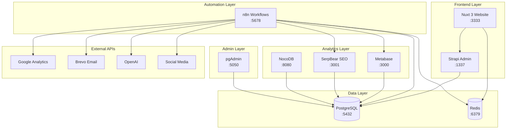
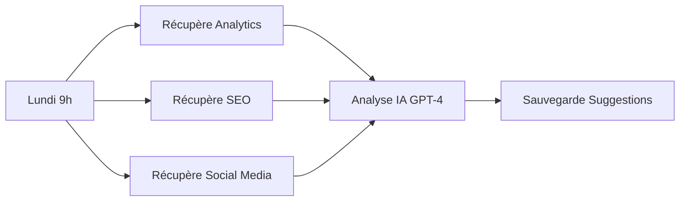
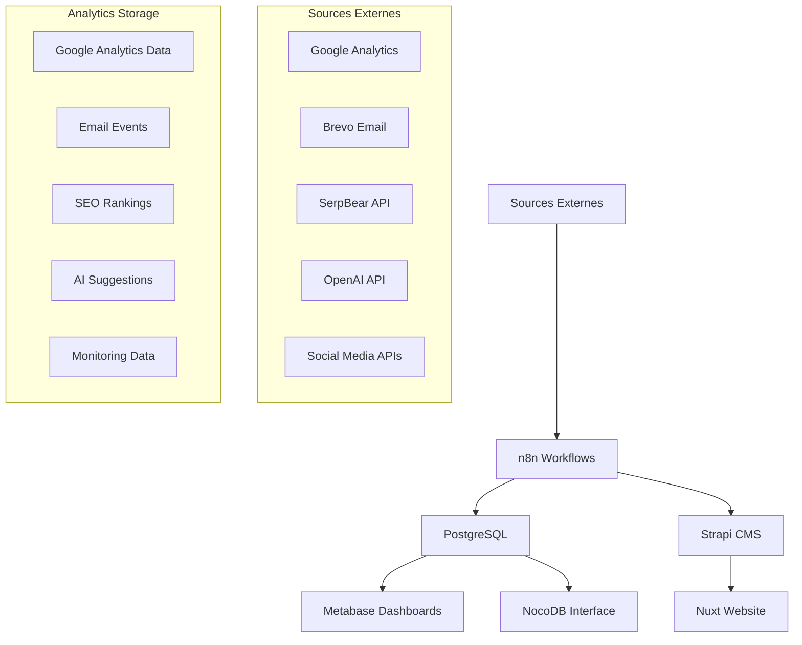
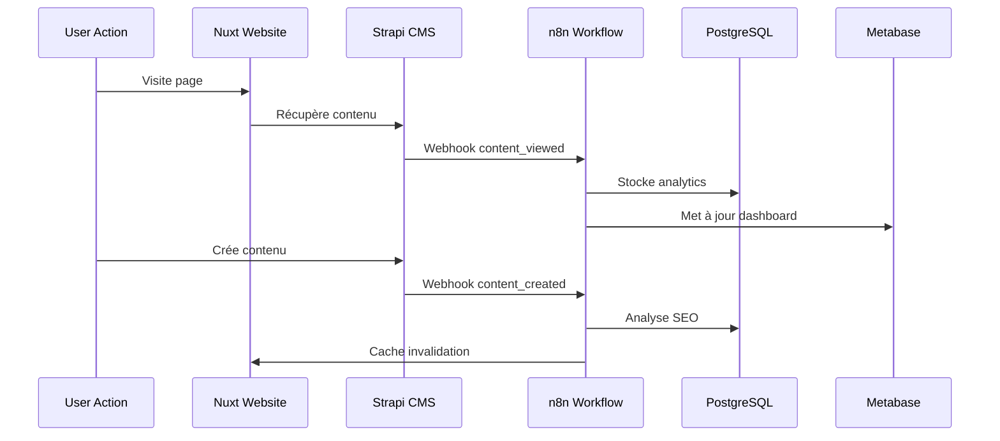
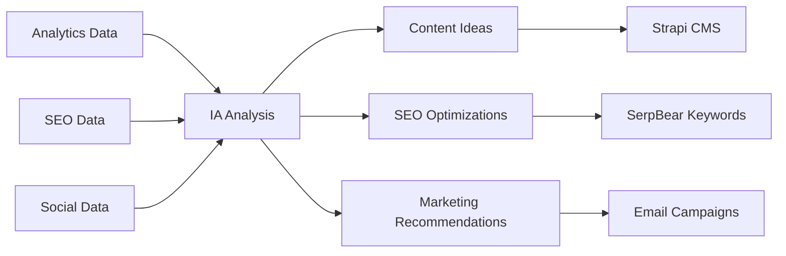
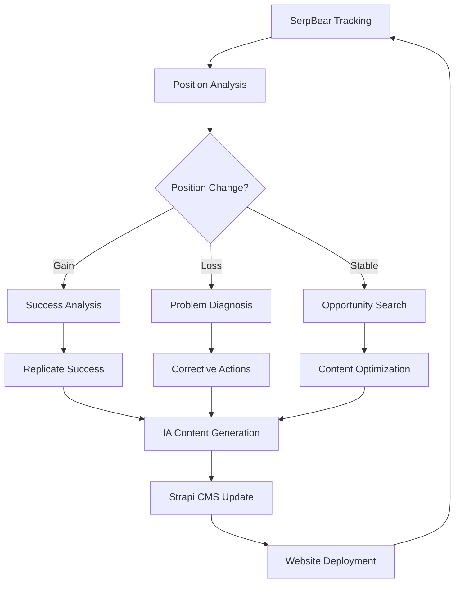
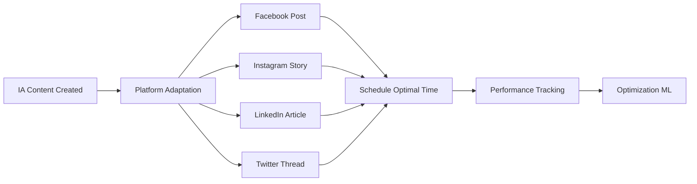

# 🚀 Strapi Automation Starter

**Plateforme d'automatisation marketing complète avec IA, analytics et workflows avancés**

Cette plateforme est un écosystème complet d'automatisation marketing qui combine CMS headless, intelligence artificielle, analytics avancés et workflows automatisés pour créer et gérer des sites web d'entreprise de manière autonome et intelligente.

## 📋 Table des Matières

- [🎯 Vue d'Ensemble](#-vue-densemble)
- [🏗️ Architecture Technique](#️-architecture-technique)
- [🔧 Services Inclus](#-services-inclus)
- [🔄 Workflows Automatisés](#-workflows-automatisés)
- [🔗 Interconnexions et APIs](#-interconnexions-et-apis)
- [🚀 Installation Rapide](#-installation-rapide)
- [⚙️ Configuration](#️-configuration)
- [📊 Analytics et Reporting](#-analytics-et-reporting)
- [🤖 Intelligence Artificielle](#-intelligence-artificielle)
- [📈 SEO et Marketing](#-seo-et-marketing)
- [🛡️ Sécurité et Monitoring](#️-sécurité-et-monitoring)
- [🔧 Administration](#-administration)
- [📋 Cas d'Usage](#-cas-dusage)
- [🆘 Dépannage](#-dépannage)

## 🎯 Vue d'Ensemble

### Concept

Cette plateforme permet de **créer automatiquement des sites web d'entreprise** connectés à un écosystème d'outils marketing avancés. Chaque déploiement crée un site Nuxt 3 personnalisé, alimenté par un CMS Strapi, avec des workflows n8n intelligents qui automatisent :

- ✅ **Génération de contenu IA** basée sur les performances analytics
- ✅ **Suivi SEO automatisé** avec alertes et recommandations
- ✅ **Analytics multi-plateformes** (Google Analytics, réseaux sociaux, email)
- ✅ **Monitoring et alertes** en temps réel
- ✅ **Rapports et dashboards** automatisés
- ✅ **Intégrations marketing** (Brevo, Google Ads, réseaux sociaux)

### Philosophie

**"Déployez une fois, automatisez tout"** - Chaque instance de cette plateforme devient un hub marketing autonome capable de :

1. 🎨 **Créer du contenu** basé sur les données de performance
2. 📊 **Analyser les tendances** et suggérer des optimisations
3. 🔍 **Monitorer le SEO** et alerter sur les changements
4. 📧 **Gérer les campagnes email** et leur performance
5. 🌐 **Surveiller la disponibilité** des services
6. 📈 **Générer des rapports** visuels automatiques

## 🏗️ Architecture Technique



### Stack Technologique

| **Couche** | **Technologies** | **Rôle** |
|------------|------------------|----------|
| **Frontend** | Nuxt 3, Vue.js, TypeScript | Sites web dynamiques et performants |
| **Backend** | Strapi, Node.js | CMS headless et API REST/GraphQL |
| **Base de Données** | PostgreSQL 15, Redis 7 | Stockage principal et cache |
| **Automatisation** | n8n, Workflows JSON | Orchestration et intégrations |
| **Analytics** | Metabase, Custom Dashboards | Visualisation et reporting |
| **SEO** | SerpBear, Google APIs | Suivi de positionnement |
| **IA** | OpenAI GPT-4, Vertex AI | Génération et analyse de contenu |
| **Orchestration** | Docker Compose | Déploiement et scaling |

## 🔧 Services Inclus

### 🌐 Nuxt 3 Website (`website:3000` → `:3333`)
**Site web frontend moderne et performant**

**Fonctionnalités :**
- 🔥 **Server-Side Rendering (SSR)** pour un SEO optimal
- ⚡ **Static Site Generation (SSG)** pour les performances
- 🎨 **Composants Vue.js réactifs** avec TypeScript
- 📱 **Design responsive** et PWA-ready
- 🔗 **Intégration native Strapi** via API REST/GraphQL
- 🌍 **Multi-langues** et internationalisation
- 🔍 **SEO automatisé** avec méta-tags dynamiques

**APIs Intégrées :**
- Google Analytics & Tag Manager
- Brevo (ex-Sendinblue) pour les newsletters
- Réseaux sociaux (Facebook, Instagram, LinkedIn)
- OpenAI pour le contenu généré par IA
- SerpBear pour les données SEO

**Variables d'environnement principales :**
```bash
STRAPI_URL=http://strapi:1337
API_BASE_URL=http://localhost:1337
GOOGLE_ANALYTICS_PROPERTY_ID=your_property_id
BREVO_API_KEY=your_brevo_key
OPENAI_API_KEY=your_openai_key
```

---

### 📝 Strapi CMS (`strapi:1337`)
**CMS headless puissant et extensible**

**Fonctionnalités :**
- 🎛️ **Interface d'administration** intuitive
- 🔧 **Content Types** flexibles et personnalisables
- 🔐 **Système d'authentification** et rôles utilisateurs
- 📡 **API REST & GraphQL** auto-générées
- 🔌 **Plugins** et extensions personnalisées
- 📂 **Gestion des médias** avec optimisation d'images
- 🌍 **Internationalisation** native

**Base de données dédiée :**
```sql
-- Database: strapi_cms
-- Tables principales :
- strapi_core_store_settings
- up_users (utilisateurs)
- up_permissions_role
- files (médias)
- [custom_content_types] (vos types de contenu)
```

**Configuration avancée :**
- Cache Redis intégré pour les performances
- Compression et optimisation automatiques
- Webhooks pour synchroniser avec n8n
- Backup automatique des contenus

---

### 🤖 n8n Automation (`n8n:5678`)
**Orchestrateur d'automatisation marketing avec 5 workflows prêts**

#### 1. 🧠 **Analyse IA et Génération de Contenu** (`ai-content-analysis.json`)
**Workflow hebdomadaire (Lundi 9h) - Génération intelligente de contenu**



**Fonctionnalités :**
- 📊 **Analyse des données** Google Analytics (7 derniers jours)
- 🔍 **Performance SEO** via SerpBear (mots-clés, positions)
- 📱 **Données réseaux sociaux** (engagement, interactions)
- 🤖 **Analyse IA GPT-4** pour générer :
  - 3 recommandations d'amélioration marketing
  - 5 idées de contenu basées sur les performances
- 💾 **Stockage intelligent** dans PostgreSQL pour Metabase

**Tables générées :**
```sql
marketing_ops.ai_content_suggestions (
  suggestion_type VARCHAR, -- 'content_idea' ou 'recommendation'
  title VARCHAR,
  content TEXT,
  priority INTEGER,
  ai_model_used VARCHAR,
  confidence_score DECIMAL,
  data_sources JSONB
)
```

#### 2. 📧 **Collecte Données Brevo Email** (`brevo-email-events.json`)
**Webhook temps réel - Tracking événements email**

**Événements trackés :**
- ✉️ **Emails envoyés** (`sent`)
- 📬 **Emails ouverts** (`opened`)
- 🖱️ **Clics sur liens** (`clicked`)
- ⚠️ **Bounces** (`bounced`)
- 🚫 **Désabonnements** (`unsubscribed`)
- 📧 **Plaintes spam** (`spam`)

**Endpoint webhook :**
```
POST http://your-domain:5678/webhook/brevo-webhook
```

**Configuration Brevo :**
1. Aller dans Brevo → Paramètres → Webhooks
2. Ajouter l'URL ci-dessus
3. Sélectionner tous les événements email
4. Secret webhook : `BREVO_WEBHOOK_SECRET`

#### 3. 📊 **Collecte Google Analytics** (`google-analytics-daily.json`)
**Quotidien 3h du matin - Analytics automatisés**

**Métriques collectées :**
- 👥 **Sessions et utilisateurs** (nouveaux/récurrents)
- 📄 **Pages vues** et temps de session
- 📱 **Répartition par device** (mobile/desktop/tablet)
- 🌍 **Géolocalisation** des visiteurs
- 🔗 **Sources de trafic** (organic/social/direct/referral)
- ⚡ **Taux de rebond** et engagement

**Configuration Google Analytics :**
1. Créer un projet Google Cloud Console
2. Activer l'API Google Analytics Data
3. Créer des credentials OAuth2
4. Configurer `GOOGLE_ANALYTICS_PROPERTY_ID`

#### 4. 🔍 **SerpBear Rankings** (`serpbear-rankings.json`)
**Quotidien 5h du matin - Suivi SEO automatisé**

**Fonctionnalités avancées :**
- 📈 **Positions Google** pour tous vos mots-clés
- 📊 **Évolution des positions** (comparaison jour précédent)
- 🎯 **Calcul automatique** des gains/pertes
- 📱 **Suivi multi-device** (mobile/desktop)
- 🌍 **Géolocalisation** des recherches
- ⚠️ **Alertes** en cas de chute significative

**Algorithme de calcul des changements :**
```sql
-- Calcul automatique des évolutions
UPDATE serpbear_rankings sr1
SET change_from_previous = (
  CASE 
    WHEN sr2.position IS NOT NULL AND sr1.position IS NOT NULL 
    THEN sr2.position - sr1.position
    ELSE 0
  END
)
WHERE sr1.date_collected = CURRENT_DATE
  AND sr2.date_collected = CURRENT_DATE - INTERVAL '1 day'
```

#### 5. 🔍 **Website Monitoring** (`website-monitoring.json`)
**Toutes les 15 minutes - Surveillance infrastructure**

**Services surveillés :**
- 🌐 **Website Nuxt** (`http://website:3000`)
- 📝 **Strapi CMS** (`http://strapi:1337`)
- 🗄️ **NocoDB** (`http://nocodb:8080`)
- 🤖 **n8n Interface** (`http://n8n:5678`)
- 📊 **Metabase** (`http://metabase:3000`)
- 🔍 **SerpBear** (`http://serpbear:3000`)

**Métriques collectées :**
- ⏱️ **Temps de réponse** (ms)
- 📊 **Code de statut HTTP**
- 📏 **Taille de contenu**
- 🏷️ **Titre de page** extrait
- ⚠️ **Alertes automatiques** en cas de panne

---

### 🗄️ PostgreSQL (`postgres:5432`)
**Base de données principale avec 6 databases spécialisées**

#### Structure des bases :

```sql
-- 1. automation_hub (base principale)
CREATE DATABASE automation_hub;

-- 2. strapi_cms (contenu et API)
CREATE DATABASE strapi_cms;

-- 3. nocodb_app (interface no-code)
CREATE DATABASE nocodb_app;

-- 4. n8n_workflows (workflows et historique)
CREATE DATABASE n8n_workflows;

-- 5. metabase_analytics (configuration dashboards)
CREATE DATABASE metabase_analytics;

-- 6. serpbear_seo (données SEO)
CREATE DATABASE serpbear_seo;
```

#### Schéma marketing_ops (analytics centralisés) :

```sql
-- Google Analytics Data
CREATE TABLE marketing_ops.google_analytics_data (
  property_id VARCHAR,
  date_collected DATE,
  traffic_source VARCHAR,
  device_category VARCHAR,
  country VARCHAR,
  sessions INTEGER,
  users INTEGER,
  new_users INTEGER,
  page_views INTEGER,
  bounce_rate DECIMAL,
  avg_session_duration DECIMAL,
  metric_name VARCHAR,
  metric_value DECIMAL,
  raw_data JSONB
);

-- SerpBear Rankings
CREATE TABLE marketing_ops.serpbear_rankings (
  domain VARCHAR,
  keyword VARCHAR,
  search_engine VARCHAR DEFAULT 'google',
  country VARCHAR DEFAULT 'fr',
  device VARCHAR DEFAULT 'desktop',
  position INTEGER,
  url VARCHAR,
  date_collected DATE,
  search_volume INTEGER,
  difficulty INTEGER,
  change_from_previous INTEGER,
  raw_data JSONB,
  updated_at TIMESTAMP DEFAULT NOW()
);

-- Brevo Email Events
CREATE TABLE marketing_ops.brevo_email_events (
  event_type VARCHAR, -- sent, opened, clicked, bounced, etc.
  email VARCHAR,
  subject VARCHAR,
  campaign_id VARCHAR,
  message_id VARCHAR,
  recipient_email VARCHAR,
  tags JSONB,
  event_date TIMESTAMP
);

-- AI Content Suggestions
CREATE TABLE marketing_ops.ai_content_suggestions (
  suggestion_type VARCHAR, -- content_idea, recommendation
  title VARCHAR,
  content TEXT,
  priority INTEGER,
  ai_model_used VARCHAR,
  confidence_score DECIMAL,
  data_sources JSONB,
  created_at TIMESTAMP DEFAULT NOW()
);

-- Website Monitoring
CREATE TABLE marketing_ops.website_monitoring (
  url_checked VARCHAR,
  http_status_code INTEGER,
  response_time_ms INTEGER,
  content_length INTEGER,
  extracted_title VARCHAR,
  is_available BOOLEAN,
  error_message TEXT,
  fetch_timestamp TIMESTAMP DEFAULT NOW()
);

-- Social Media Data (extensible)
CREATE TABLE marketing_ops.social_media_data (
  platform VARCHAR, -- facebook, instagram, linkedin
  post_id VARCHAR,
  content TEXT,
  likes INTEGER,
  comments INTEGER,
  shares INTEGER,
  reach INTEGER,
  engagement_rate DECIMAL,
  date_collected DATE,
  raw_data JSONB
);
```

---

### 🚀 Redis (`redis:6379`)
**Cache haute performance et sessions**

#### Répartition des databases Redis :

```bash
# DB 0: Strapi CMS (sessions, cache contenu)
# DB 1: NocoDB cache
# DB 2-15: Disponibles pour workflows n8n personnalisés
```

**Utilisations spécifiques :**
- 🔄 **Cache Strapi** : Contenu, requêtes API, sessions admin
- ⚡ **Cache NocoDB** : Résultats de requêtes, configurations
- 🤖 **Workflows n8n** : États temporaires, rate limiting
- 🌐 **Sessions website** : Authentification utilisateurs

---

### 📊 Metabase (`metabase:3000`)
**Plateforme d'analytics et dashboards**

#### Dashboards pré-configurés :

1. **📈 Marketing Overview**
   - Évolution du trafic (Google Analytics)
   - Performance SEO (SerpBear)
   - Engagement email (Brevo)
   - ROI par canal

2. **🔍 SEO Performance**
   - Top mots-clés et évolutions
   - Analyse de la concurrence
   - Opportunités d'amélioration
   - Corrélations trafic/positions

3. **📧 Email Marketing**
   - Taux d'ouverture et clics
   - Segmentation audiences
   - A/B testing résultats
   - Performance par campagne

4. **🤖 AI Insights**
   - Suggestions de contenu générées
   - Score de confiance IA
   - Tendances identifiées
   - ROI des recommandations

5. **🛡️ Infrastructure Monitoring**
   - Disponibilité des services
   - Temps de réponse
   - Alertes et incidents
   - Performance globale

**Configuration automatique :**
- Connexion PostgreSQL préconfigurée
- Questions et dashboards importés
- Alertes email automatiques
- Export PDF/CSV programmé

---

### 🔍 SerpBear (`serpbear:3001`)
**Suivi de positionnement SEO professionnel**

**Fonctionnalités avancées :**
- 🎯 **Suivi multi-mots-clés** illimité
- 🌍 **Géolocalisation** des recherches (France, international)
- 📱 **Desktop & Mobile** séparément
- 📊 **Historique complet** des positions
- ⚠️ **Alertes** email/webhook
- 🔄 **API REST** pour intégrations n8n
- 📈 **Graphiques d'évolution** temps réel

**Configuration API :**
```bash
# Génération de la clé API dans l'interface SerpBear
SERPBEAR_API_KEY=your_generated_api_key

# Endpoints disponibles :
GET /api/keywords - Liste tous les mots-clés
GET /api/keywords/{id} - Détails d'un mot-clé
POST /api/keywords - Ajouter un mot-clé
PUT /api/keywords/{id} - Modifier un mot-clé
DELETE /api/keywords/{id} - Supprimer un mot-clé
```

---

### 🗄️ NocoDB (`nocodb:8080`)
**Interface no-code pour bases de données**

**Avantages pour les non-techniques :**
- 📊 **Interface type Airtable** pour PostgreSQL
- 🔗 **Formulaires** de saisie automatiques
- 📈 **Vues personnalisées** (calendrier, kanban, galerie)
- 🔍 **Filtres et tri** avancés
- 📱 **API REST automatique** générée
- 👥 **Partage et collaboration**
- 🔗 **Webhooks** pour intégrations

**Cas d'usage :**
- ✏️ **Gestion du contenu** Strapi sans technique
- 📊 **Visualisation des analytics** simplifié
- 📝 **Saisie manuelle** de données marketing
- 🎯 **Gestion des mots-clés** SEO
- 👥 **Base de contacts** et leads
- 📋 **Todo lists** et projets marketing

**Configuration :**
- Base PostgreSQL partagée
- Redis pour le cache
- Authentification JWT
- Connexion directe aux tables marketing_ops

---

### 🛠️ pgAdmin (`pgadmin:5050`)
**Interface d'administration PostgreSQL**

**Fonctionnalités :**
- 🗄️ **Exploration** de toutes les bases
- ✏️ **Éditeur SQL** avancé avec syntax highlighting
- 📊 **Monitoring** performance et requêtes
- 🔧 **Gestion des utilisateurs** et permissions
- 📁 **Import/Export** données (CSV, JSON, SQL)
- 🔍 **Analyseur de requêtes** et optimisation
- 📈 **Statistiques** d'utilisation des tables

**Accès pré-configuré :**
- Toutes les 6 databases connectées
- Utilisateur admin configuré
- Dashboards de monitoring inclus

## 🔄 Workflows Automatisés

### 🕐 Planning d'Exécution

```mermaid
gantt
    title Planning des Workflows Automatisés
    dateFormat  HH:mm
    axisFormat %H:%M

    section Quotidien
    Google Analytics     :03:00, 30m
    SerpBear Rankings    :05:00, 45m
    
    section Continu
    Website Monitoring   :00:00, 24h
    Brevo Webhooks      :00:00, 24h
    
    section Hebdomadaire
    AI Content Analysis  :crit, 09:00, 2h
```



### 🔄 Flux de Données



### 📊 Métriques et KPIs Automatisés

| **Métrique** | **Fréquence** | **Source** | **Action Automatique** |
|--------------|---------------|------------|------------------------|
| **Trafic Web** | Quotidien | Google Analytics | Génération contenu IA si baisse >10% |
| **Positions SEO** | Quotidien | SerpBear | Alerte si chute >5 positions |
| **Email Performance** | Temps réel | Brevo | Segmentation automatique audiences |
| **Uptime Services** | 15 min | Monitoring | Notification immédiate si panne |
| **Engagement Social** | Hebdomadaire | APIs Social | Suggestions posts IA |

## 🔗 Interconnexions et APIs

### 🌐 APIs Externes Intégrées

#### Google Ecosystem
```bash
# Google Analytics Data API v1
GOOGLE_ANALYTICS_PROPERTY_ID=123456789
GOOGLE_CLIENT_ID=your_client_id.apps.googleusercontent.com
GOOGLE_CLIENT_SECRET=your_client_secret

# Google Ads API (optionnel)
GOOGLE_ADS_CUSTOMER_ID=123-456-7890

# Google Vertex AI pour IA avancée
GOOGLE_VERTEX_AI_PROJECT_ID=your_project_id
GOOGLE_VERTEX_AI_LOCATION=europe-west1
```

#### Brevo (ex-Sendinblue)
```bash
# API v3 complète
BREVO_API_KEY=xkeysib-your_brevo_api_key
BREVO_WEBHOOK_SECRET=your_webhook_secret

# Fonctionnalités disponibles :
# - Envoi emails transactionnels
# - Gestion listes contacts
# - Campagnes automatisées
# - A/B testing
# - Segmentation avancée
```

#### Réseaux Sociaux
```bash
# Facebook & Instagram
FACEBOOK_APP_ID=your_facebook_app_id
FACEBOOK_APP_SECRET=your_facebook_app_secret
INSTAGRAM_ACCESS_TOKEN=your_instagram_token

# LinkedIn
LINKEDIN_CLIENT_ID=your_linkedin_client_id
LINKEDIN_CLIENT_SECRET=your_linkedin_client_secret

# Données récupérées :
# - Posts et engagement
# - Reach et impressions
# - Données démographiques
# - ROI publicitaire
```

#### Intelligence Artificielle
```bash
# OpenAI GPT-4
OPENAI_API_KEY=sk-your_openai_api_key

# Utilisations :
# - Analyse de contenu
# - Génération d'articles
# - Recommandations marketing
# - Optimisation SEO
# - Réponses chatbot
```

### 🔌 APIs Internes

#### Strapi CMS API
```javascript
// REST API
GET    /api/articles
POST   /api/articles
PUT    /api/articles/:id
DELETE /api/articles/:id

// GraphQL endpoint
POST   /graphql

// Webhooks Strapi vers n8n
POST   /webhook/strapi-content-updated
POST   /webhook/strapi-user-registered
```

#### n8n Webhooks
```javascript
// Brevo Email Events
POST /webhook/brevo-webhook

// Monitoring Alerts
POST /webhook/monitoring-alert

// Custom Triggers
POST /webhook/custom-trigger/:workflow_id
```

#### SerpBear API
```javascript
// API REST complète
GET    /api/keywords
POST   /api/keywords
PUT    /api/keywords/:id
DELETE /api/keywords/:id
GET    /api/domains
GET    /api/results/:keyword_id
```

### 🔄 Synchronisation des Données

#### Workflow de Synchronisation Temps Réel



## 🚀 Installation Rapide

### Prérequis

- 🐳 **Docker** et **Docker Compose** installés
- 🔧 **8 GB RAM** minimum recommandé
- 💾 **20 GB d'espace disque** libre
- 🌐 **Accès internet** pour les APIs externes

### Installation en 5 Minutes

```bash
# 1. Cloner le repository
git clone https://github.com/your-repo/strapi-automation-starter.git
cd strapi-automation-starter

# 2. Copier et configurer l'environnement
cp .env.example .env
nano .env  # Éditer vos clés API

# 3. Lancer tous les services
docker-compose up -d

# 4. Vérifier le déploiement
docker-compose ps
```

### Vérification de l'Installation

Attendez 2-3 minutes puis vérifiez les services :

```bash
# Services opérationnels
curl http://localhost:3333  # Nuxt Website
curl http://localhost:1337  # Strapi CMS
curl http://localhost:5678  # n8n Workflows
curl http://localhost:3000  # Metabase
curl http://localhost:3001  # SerpBear
curl http://localhost:8080  # NocoDB
curl http://localhost:5050  # pgAdmin
```

### Accès aux Interfaces

| **Service** | **URL** | **Identifiants par défaut** |
|-------------|---------|------------------------------|
| 🌐 **Website** | http://localhost:3333 | - (public) |
| 📝 **Strapi Admin** | http://localhost:1337/admin | (créer lors du 1er accès) |
| 🤖 **n8n** | http://localhost:5678 | admin / (voir .env) |
| 📊 **Metabase** | http://localhost:3000 | (configuration au 1er accès) |
| 🔍 **SerpBear** | http://localhost:3001 | (créer compte au 1er accès) |
| 🗄️ **NocoDB** | http://localhost:8080 | (créer au 1er accès) |
| 🛠️ **pgAdmin** | http://localhost:5050 | admin@votre-domaine.com / (voir .env) |

## ⚙️ Configuration

### 🔐 Configuration des APIs

#### 1. Google Analytics Setup

```bash
# 1. Google Cloud Console
# - Créer un projet
# - Activer Google Analytics Data API
# - Créer des credentials OAuth2

# 2. Configuration n8n
# - Aller dans n8n → Credentials
# - Ajouter "Google Analytics OAuth2 API"
# - Copier Client ID/Secret depuis Google Cloud

# 3. Variables .env
GOOGLE_ANALYTICS_PROPERTY_ID=123456789
GOOGLE_CLIENT_ID=your_id.apps.googleusercontent.com
GOOGLE_CLIENT_SECRET=your_secret
```

#### 2. Brevo Email Setup

```bash
# 1. Compte Brevo (gratuit jusqu'à 300 emails/jour)
# - S'inscrire sur https://app.brevo.com
# - Aller dans Paramètres → Clés API
# - Créer une nouvelle clé

# 2. Configuration webhook
# - Paramètres → Webhooks
# - URL : http://your-domain:5678/webhook/brevo-webhook
# - Événements : tous les événements email

# 3. Variables .env
BREVO_API_KEY=xkeysib-your_key
BREVO_WEBHOOK_SECRET=your_secret
```

#### 3. OpenAI Setup

```bash
# 1. Compte OpenAI
# - S'inscrire sur https://platform.openai.com
# - Aller dans API Keys
# - Créer une nouvelle clé

# 2. Variables .env
OPENAI_API_KEY=sk-your_openai_key

# 3. Créer le credential dans n8n
# - Credentials → Add → OpenAI
# - Coller la clé API
```

### 🔧 Configuration Avancée

#### Customisation des Workflows

```bash
# Éditer les workflows n8n
cd n8n/workflows/

# Modifier les fréquences
nano ai-content-analysis.json
# Changer "0 9 * * 1" pour une autre planification

# Ajouter des intégrations
# Les workflows sont en JSON, modifiables via interface n8n
```

#### Optimisation Performance

```yaml
# docker-compose.override.yml
version: '3.8'
services:
  postgres:
    command: >
      postgres
      -c shared_preload_libraries=pg_stat_statements
      -c pg_stat_statements.max=10000
      -c pg_stat_statements.track=all
    
  redis:
    command: redis-server --maxmemory 512mb --maxmemory-policy allkeys-lru
```

#### Configuration SSL/HTTPS

```nginx
# nginx.conf (pour production)
server {
    listen 443 ssl;
    server_name your-domain.com;
    
    ssl_certificate /path/to/cert.pem;
    ssl_certificate_key /path/to/key.pem;
    
    location / {
        proxy_pass http://localhost:3333;
        proxy_set_header Host $host;
        proxy_set_header X-Real-IP $remote_addr;
    }
    
    location /admin {
        proxy_pass http://localhost:1337;
    }
    
    location /n8n {
        proxy_pass http://localhost:5678;
    }
}
```

## 📊 Analytics et Reporting

### 📈 Dashboards Metabase

#### 1. Marketing Dashboard Global

**Métriques clés affichées :**
- 📊 **Trafic** : Sessions, utilisateurs, pages vues (7/30 jours)
- 🔍 **SEO** : Positions moyennes, mots-clés top 3, évolutions
- 📧 **Email** : Taux d'ouverture, clics, conversions
- 💰 **ROI** : Revenus par canal, coût d'acquisition
- 🎯 **Objectifs** : Progression vers les KPIs définis

**Requêtes SQL exemple :**
```sql
-- Evolution du trafic sur 30 jours
SELECT 
  date_collected,
  SUM(sessions) as total_sessions,
  SUM(users) as total_users,
  AVG(bounce_rate) as avg_bounce_rate
FROM marketing_ops.google_analytics_data 
WHERE date_collected >= CURRENT_DATE - INTERVAL '30 days'
GROUP BY date_collected
ORDER BY date_collected;

-- Top 10 mots-clés performers
SELECT 
  keyword,
  AVG(position) as avg_position,
  COUNT(*) as tracking_days,
  AVG(change_from_previous) as avg_change
FROM marketing_ops.serpbear_rankings 
WHERE date_collected >= CURRENT_DATE - INTERVAL '30 days'
  AND position <= 10
GROUP BY keyword
ORDER BY avg_position ASC
LIMIT 10;
```

#### 2. SEO Performance Dashboard

**Widgets spécialisés :**
- 🎯 **Mots-clés gagnants** (progressions >5 positions)
- ⚠️ **Alertes SEO** (chutes >3 positions)
- 📊 **Distribution positions** (top 3, 4-10, 11-20, etc.)
- 🔍 **Opportunités** (mots-clés 11-20 à pousser)
- 📈 **Corrélations** trafic/positions

#### 3. Email Marketing Analytics

**Métriques avancées :**
- 📧 **Funnel conversion** (envoyé → ouvert → cliqué → converti)
- 🎯 **Segmentation performance** par audience
- ⏰ **Optimisation horaires** d'envoi
- 📱 **Performance par device**
- 🔄 **A/B testing** résultats

#### 4. AI Content Performance

**Suivi des recommandations IA :**
- 💡 **Idées de contenu** générées et utilisées
- 📊 **Score de confiance** vs performance réelle
- 🎯 **ROI des suggestions** implémentées
- 🔄 **Amélioration continue** du modèle IA

### 📋 Rapports Automatisés

#### Rapport Hebdomadaire PDF

```sql
-- Génération automatique chaque lundi
WITH weekly_stats AS (
  SELECT 
    'Traffic' as metric,
    SUM(sessions) as current_week,
    LAG(SUM(sessions)) OVER () as previous_week
  FROM google_analytics_data 
  WHERE date_collected >= CURRENT_DATE - INTERVAL '7 days'
  
  UNION ALL
  
  SELECT 
    'SEO_Avg_Position' as metric,
    AVG(position) as current_week,
    (SELECT AVG(position) FROM serpbear_rankings 
     WHERE date_collected >= CURRENT_DATE - INTERVAL '14 days'
     AND date_collected < CURRENT_DATE - INTERVAL '7 days') as previous_week
  FROM serpbear_rankings 
  WHERE date_collected >= CURRENT_DATE - INTERVAL '7 days'
)
SELECT * FROM weekly_stats;
```

#### Alertes Automatiques

**Conditions déclenchement :**
- 🚨 **Trafic** : Baisse >20% par rapport à la semaine précédente
- 🔍 **SEO** : >5 mots-clés perdent >5 positions
- 📧 **Email** : Taux d'ouverture <15% sur 3 campagnes consécutives
- 🛡️ **Monitoring** : Service indisponible >5 minutes

## 🤖 Intelligence Artificielle

### 🧠 Modèles IA Intégrés

#### GPT-4 pour l'Analyse Marketing

**Prompt Engineering avancé :**
```javascript
const marketingPrompt = `
Analyse marketing hebdomadaire pour ${domain}:

DONNÉES ANALYTICS (7 derniers jours):
${analyticsData.map(d => 
  `- ${d.traffic_source}: ${d.avg_sessions} sessions, ${d.avg_bounce_rate}% bounce rate`
).join('\n')}

PERFORMANCES SEO (top keywords):
${seoData.map(d => 
  `- "${d.keyword}": position ${d.avg_position} ${d.change_from_previous > 0 ? '📈' : '📉'} ${Math.abs(d.change_from_previous)}`
).join('\n')}

RÉSEAUX SOCIAUX:
${socialData.map(d => 
  `- ${d.platform}: ${d.avg_engagement}% engagement, ${d.total_interactions} interactions`
).join('\n')}

MISSION:
1. Génère 3 recommandations SMART d'amélioration
2. Propose 5 idées de contenu basées sur les données
3. Identifie 2 opportunités SEO prioritaires
4. Suggère 1 optimisation technique

FORMAT: JSON avec {recommendations: [], content_ideas: [], seo_opportunities: [], technical_optimization: ""}
`;
```

#### Algorithmes de Scoring

**Score de Performance Marketing :**
```javascript
function calculateMarketingScore(data) {
  const weights = {
    traffic_growth: 0.3,
    seo_positions: 0.25,
    email_engagement: 0.2,
    social_engagement: 0.15,
    conversion_rate: 0.1
  };
  
  // Calcul composite avec IA
  const score = Object.entries(weights).reduce((total, [metric, weight]) => {
    return total + (normalizeMetric(data[metric]) * weight);
  }, 0);
  
  return Math.round(score * 100);
}
```

### 🎯 Use Cases IA Avancés

#### 1. Génération de Contenu Automatique



**Types de contenu générés :**
- 📝 **Articles de blog** optimisés SEO
- 📧 **Newsletters** personnalisées
- 📱 **Posts réseaux sociaux** avec hashtags
- 🎯 **Meta descriptions** et titles
- 📋 **Landing pages** pour campagnes

#### 2. Optimisation SEO Intelligente

**Analyse sémantique avancée :**
```python
# Pseudo-code de l'algorithme IA SEO
def optimize_content_for_seo(content, target_keywords, competitor_data):
    # Analyse sémantique du contenu
    semantic_analysis = analyze_content_semantics(content)
    
    # Identification des opportunités
    opportunities = find_semantic_gaps(semantic_analysis, competitor_data)
    
    # Génération de suggestions
    suggestions = generate_seo_improvements(opportunities, target_keywords)
    
    return {
        'keyword_density': optimize_keyword_density(content, target_keywords),
        'semantic_keywords': suggest_semantic_keywords(opportunities),
        'content_structure': optimize_headings_structure(content),
        'internal_links': suggest_internal_links(content, existing_content)
    }
```

#### 3. Prédiction de Performance

**Machine Learning pour Marketing :**
- 📈 **Prédiction trafic** basée sur saisonnalité + tendances
- 🎯 **Scoring leads** automatique avec probabilité conversion
- 📧 **Optimisation send time** email par utilisateur
- 🔍 **Prédiction positions SEO** après optimisations

### 🔧 Configuration IA Avancée

#### Fine-tuning des Modèles

```yaml
# config/ai-models.yml
openai:
  model: "gpt-4"
  max_tokens: 2000
  temperature: 0.7
  top_p: 0.9
  frequency_penalty: 0.1
  presence_penalty: 0.1

content_generation:
  tone: "professionnel mais accessible"
  language: "français"
  style: "informatif et engageant"
  target_audience: "décideurs entreprise"

seo_optimization:
  keyword_density_target: 1.5  # %
  semantic_keywords_count: 10
  readability_score_min: 60
  content_length_min: 800
```

#### Intégration Vertex AI (Google)

```javascript
// Configuration alternative Google Vertex AI
const vertexAI = {
  project_id: process.env.GOOGLE_VERTEX_AI_PROJECT_ID,
  location: process.env.GOOGLE_VERTEX_AI_LOCATION,
  model: "text-bison@001",
  
  // Prompt pour analyse marketing en français
  generateInsights: async (marketingData) => {
    const prompt = `Analyse ces données marketing et donne des recommandations en français: ${JSON.stringify(marketingData)}`;
    return await vertexAI.predict(prompt);
  }
};
```

## 📈 SEO et Marketing

### 🔍 Stratégie SEO Automatisée

#### Workflow SEO Complet



#### Métriques SEO Avancées

**KPIs trackés automatiquement :**
- 🎯 **Visibilité organique** (positions pondérées par volume)
- 📊 **Share of Voice** par rapport à la concurrence
- 🔍 **Capture de featured snippets**
- 📱 **Performance mobile vs desktop**
- 🌍 **Positionnement géolocalisé**
- ⚡ **Core Web Vitals** et PageSpeed

**Calcul de la visibilité organique :**
```sql
-- Calcul automatique de la visibilité SEO
WITH visibility_calc AS (
  SELECT 
    keyword,
    position,
    search_volume,
    CASE 
      WHEN position = 1 THEN 0.315
      WHEN position = 2 THEN 0.158
      WHEN position = 3 THEN 0.100
      WHEN position <= 10 THEN 0.05 * (11 - position) / 10
      ELSE 0
    END as ctr_estimated,
    search_volume * (CASE 
      WHEN position = 1 THEN 0.315
      WHEN position = 2 THEN 0.158
      WHEN position = 3 THEN 0.100
      WHEN position <= 10 THEN 0.05 * (11 - position) / 10
      ELSE 0
    END) as estimated_traffic
  FROM marketing_ops.serpbear_rankings 
  WHERE date_collected = CURRENT_DATE
)
SELECT 
  SUM(estimated_traffic) as total_estimated_traffic,
  AVG(position) as avg_position,
  COUNT(*) as total_keywords
FROM visibility_calc;
```

### 📧 Email Marketing Automation

#### Segmentation Intelligente

**Algorithme de scoring utilisateurs :**
```javascript
function calculateUserScore(user_data) {
  const engagement_score = (
    user_data.email_opens * 2 +
    user_data.email_clicks * 5 +
    user_data.page_views * 1 +
    user_data.time_on_site / 60 * 0.5
  );
  
  const recency_score = Math.max(0, 100 - (
    (Date.now() - user_data.last_activity) / (1000 * 60 * 60 * 24)
  ));
  
  return {
    engagement: Math.min(100, engagement_score),
    recency: recency_score,
    combined: (engagement_score + recency_score) / 2
  };
}
```

#### Campagnes Automatisées

**Types de campagnes n8n :**

1. **🎯 Welcome Series**
   ```json
   {
     "trigger": "user_registration",
     "sequence": [
       {"delay": "1 hour", "template": "welcome_email"},
       {"delay": "3 days", "template": "getting_started"},
       {"delay": "7 days", "template": "advanced_features"},
       {"delay": "14 days", "template": "success_stories"}
     ]
   }
   ```

2. **🔄 Re-engagement Campaign**
   ```json
   {
     "trigger": "inactive_30_days",
     "condition": "email_opens < 5 AND page_views < 10",
     "action": "send_reengagement_series"
   }
   ```

3. **🎉 Behavior-based Triggers**
   ```json
   {
     "triggers": [
       {"event": "downloaded_resource", "action": "send_related_content"},
       {"event": "abandoned_cart", "action": "send_reminder_24h"},
       {"event": "high_engagement", "action": "send_premium_offer"}
     ]
   }
   ```

### 📱 Social Media Integration

#### Automation Multi-Plateformes

**Workflow publication automatique :**


**Optimisation par plateforme :**
```javascript
const platformOptimization = {
  facebook: {
    max_length: 2000,
    optimal_time: "15:00-17:00",
    hashtags_max: 3,
    image_ratio: "1200x630"
  },
  instagram: {
    max_length: 150,
    optimal_time: "11:00-14:00",
    hashtags_max: 30,
    image_ratio: "1080x1080"
  },
  linkedin: {
    max_length: 3000,
    optimal_time: "08:00-10:00",
    hashtags_max: 5,
    image_ratio: "1200x627"
  }
};
```

### 💰 ROI Tracking et Attribution

#### Modèle d'Attribution Multi-Touch

```sql
-- Attribution marketing multi-canal
WITH customer_journey AS (
  SELECT 
    user_id,
    channel,
    touchpoint_value,
    conversion_value,
    LAG(channel) OVER (PARTITION BY user_id ORDER BY timestamp) as previous_channel,
    LEAD(channel) OVER (PARTITION BY user_id ORDER BY timestamp) as next_channel
  FROM marketing_ops.customer_touchpoints
  WHERE timestamp >= CURRENT_DATE - INTERVAL '30 days'
),
attribution_weights AS (
  SELECT 
    user_id,
    channel,
    CASE 
      WHEN previous_channel IS NULL THEN 0.4  -- First touch
      WHEN next_channel IS NULL THEN 0.4      -- Last touch
      ELSE 0.2 / COUNT(*) OVER (PARTITION BY user_id)  -- Middle touches
    END as attribution_weight,
    conversion_value
  FROM customer_journey
)
SELECT 
  channel,
  SUM(attribution_weight * conversion_value) as attributed_revenue,
  COUNT(DISTINCT user_id) as unique_users,
  SUM(attributed_revenue) / SUM(marketing_cost) as roi
FROM attribution_weights
GROUP BY channel
ORDER BY attributed_revenue DESC;
```

## 🛡️ Sécurité et Monitoring

### 🔐 Sécurité Infrastructure

#### Configuration Sécurisée

**Variables sensibles (.env) :**
```bash
# OBLIGATOIRE : Changez ces valeurs en production !
POSTGRES_PASSWORD=your_super_secure_password_2024!
STRAPI_JWT_SECRET=$(openssl rand -base64 32)
STRAPI_ADMIN_JWT_SECRET=$(openssl rand -base64 32)
N8N_ENCRYPTION_KEY=$(openssl rand -base64 32)
METABASE_ENCRYPTION_KEY=$(openssl rand -base64 32)

# Clés API (ne jamais commiter)
OPENAI_API_KEY=sk-your_secret_key
BREVO_API_KEY=xkeysib-your_secret_key
GOOGLE_CLIENT_SECRET=your_secret
```

**Permissions PostgreSQL :**
```sql
-- Utilisateur lecture seule pour Metabase
CREATE USER metabase_reader WITH PASSWORD 'secure_password';
GRANT CONNECT ON DATABASE automation_hub TO metabase_reader;
GRANT USAGE ON SCHEMA marketing_ops TO metabase_reader;
GRANT SELECT ON ALL TABLES IN SCHEMA marketing_ops TO metabase_reader;

-- Utilisateur limité pour NocoDB
CREATE USER nocodb_user WITH PASSWORD 'secure_password';
GRANT CONNECT ON DATABASE automation_hub TO nocodb_user;
GRANT USAGE, CREATE ON SCHEMA public TO nocodb_user;
```

#### Protection des APIs

**Rate limiting n8n :**
```javascript
// Middleware rate limiting dans les workflows
const rateLimiter = {
  requests_per_minute: 60,
  requests_per_hour: 1000,
  
  check: async (client_ip) => {
    const redis_key = `rate_limit:${client_ip}`;
    const current_count = await redis.get(redis_key);
    
    if (current_count && current_count > 60) {
      throw new Error('Rate limit exceeded');
    }
    
    await redis.incr(redis_key);
    await redis.expire(redis_key, 60);
  }
};
```

### 📊 Monitoring Avancé

#### Métriques Infrastructure

**Dashboard Monitoring (Metabase) :**
```sql
-- Performance des services
SELECT 
  service_name,
  AVG(response_time_ms) as avg_response_time,
  (COUNT(*) FILTER (WHERE is_available = true) * 100.0 / COUNT(*)) as uptime_percentage,
  COUNT(*) FILTER (WHERE response_time_ms > 5000) as slow_requests
FROM marketing_ops.website_monitoring 
WHERE fetch_timestamp >= CURRENT_DATE - INTERVAL '24 hours'
GROUP BY service_name;

-- Erreurs par service
SELECT 
  service_name,
  http_status_code,
  COUNT(*) as error_count,
  MAX(fetch_timestamp) as last_occurrence
FROM marketing_ops.website_monitoring 
WHERE is_available = false 
  AND fetch_timestamp >= CURRENT_DATE - INTERVAL '7 days'
GROUP BY service_name, http_status_code
ORDER BY error_count DESC;
```

#### Alertes Intelligentes

**Système d'alertes n8n :**
```javascript
const alertingSystem = {
  rules: [
    {
      name: "High Response Time",
      condition: "avg_response_time > 5000",
      severity: "warning",
      notification: ["email", "slack"]
    },
    {
      name: "Service Down",
      condition: "uptime < 95%",
      severity: "critical",
      notification: ["email", "sms", "slack"]
    },
    {
      name: "SEO Position Drop",
      condition: "position_change < -5",
      severity: "warning",
      notification: ["email"]
    }
  ],
  
  checkRules: async () => {
    for (const rule of alertingSystem.rules) {
      const result = await postgresql.query(rule.condition);
      if (result.length > 0) {
        await sendAlert(rule, result);
      }
    }
  }
};
```

### 🔄 Backup et Recovery

#### Stratégie de Sauvegarde

**Backup automatique PostgreSQL :**
```bash
#!/bin/bash
# Script de backup quotidien (à ajouter en cron)

DATE=$(date +%Y%m%d_%H%M%S)
BACKUP_DIR="/backups/postgres"

# Backup de toutes les bases
docker exec postgres_db pg_dumpall -U admin_user > $BACKUP_DIR/full_backup_$DATE.sql

# Backup spécifique marketing_ops (données critiques)
docker exec postgres_db pg_dump -U admin_user -d automation_hub -t marketing_ops.* > $BACKUP_DIR/marketing_ops_$DATE.sql

# Retention : garder 30 jours
find $BACKUP_DIR -name "*.sql" -mtime +30 -delete

# Upload vers cloud (optionnel)
# aws s3 cp $BACKUP_DIR/full_backup_$DATE.sql s3://your-backup-bucket/
```

**Recovery procédure :**
```bash
# Restauration complète
docker exec -i postgres_db psql -U admin_user < backup_file.sql

# Restauration sélective
docker exec -i postgres_db psql -U admin_user -d automation_hub < marketing_ops_backup.sql
```

## 🔧 Administration

### 👥 Gestion des Utilisateurs

#### Rôles et Permissions

**Strapi CMS :**
```javascript
// Rôles prédéfinis
const roles = {
  super_admin: {
    permissions: ["*"],
    description: "Accès complet système"
  },
  content_manager: {
    permissions: ["content.create", "content.edit", "content.publish"],
    description: "Gestion contenu uniquement"
  },
  analytics_viewer: {
    permissions: ["analytics.view", "reports.view"],
    description: "Consultation analytics"
  },
  seo_specialist: {
    permissions: ["seo.manage", "keywords.edit", "content.edit"],
    description: "Optimisation SEO"
  }
};
```

**n8n Workflows :**
```javascript
// Permissions par workflow
const workflowPermissions = {
  "ai-content-analysis": ["content_manager", "super_admin"],
  "google-analytics-daily": ["analytics_viewer", "super_admin"],
  "serpbear-rankings": ["seo_specialist", "super_admin"],
  "brevo-email-events": ["content_manager", "super_admin"],
  "website-monitoring": ["super_admin"]
};
```

### 📊 Monitoring Performance

#### Métriques Système

**Dashboard Admin (Metabase) :**
```sql
-- Performance globale système
WITH system_health AS (
  SELECT 
    'database' as component,
    pg_database_size('automation_hub')::bigint as size_bytes,
    (SELECT COUNT(*) FROM pg_stat_activity WHERE state = 'active') as active_connections
  
  UNION ALL
  
  SELECT 
    'redis' as component,
    0 as size_bytes,  -- À implémenter via monitoring externe
    0 as active_connections
),
workflow_stats AS (
  SELECT 
    workflow_name,
    COUNT(*) as executions_today,
    AVG(execution_time_ms) as avg_execution_time,
    COUNT(*) FILTER (WHERE status = 'error') as error_count
  FROM n8n_executions 
  WHERE created_at >= CURRENT_DATE
  GROUP BY workflow_name
)
SELECT * FROM system_health
UNION ALL
SELECT 
  'workflow_' || workflow_name,
  executions_today,
  avg_execution_time
FROM workflow_stats;
```

#### Optimisation Automatique

**Maintenance automatique :**
```sql
-- Script de maintenance quotidien (via n8n)
-- 1. Nettoyage données anciennes
DELETE FROM marketing_ops.website_monitoring 
WHERE fetch_timestamp < CURRENT_DATE - INTERVAL '90 days';

-- 2. Optimisation index
REINDEX TABLE marketing_ops.google_analytics_data;
ANALYZE marketing_ops.serpbear_rankings;

-- 3. Compression logs
DELETE FROM n8n_execution_entity 
WHERE "startedAt" < CURRENT_DATE - INTERVAL '30 days' 
  AND mode != 'manual';
```

### 🔄 Updates et Maintenance

#### Mise à Jour des Services

**Update workflow :**
```bash
#!/bin/bash
# Script de mise à jour sécurisée

echo "🔄 Mise à jour de la plateforme..."

# 1. Backup avant mise à jour
./scripts/backup.sh

# 2. Pull des nouvelles images
docker-compose pull

# 3. Redémarrage avec zero-downtime
docker-compose up -d --remove-orphans

# 4. Vérification santé services
sleep 30
./scripts/health-check.sh

echo "✅ Mise à jour terminée"
```

**Health check automatique :**
```bash
#!/bin/bash
# scripts/health-check.sh

services=("website:3333" "strapi:1337" "n8n:5678" "metabase:3000")
failed_services=()

for service in "${services[@]}"; do
  if ! curl -f "http://localhost:${service##*:}" >/dev/null 2>&1; then
    failed_services+=("$service")
  fi
done

if [ ${#failed_services[@]} -eq 0 ]; then
  echo "✅ Tous les services sont opérationnels"
  exit 0
else
  echo "❌ Services en erreur: ${failed_services[*]}"
  exit 1
fi
```

## 📋 Cas d'Usage

### 🏢 Entreprise de Services

**Objectif :** Site web avec génération automatique de contenu marketing

**Configuration suggérée :**
```yaml
use_case: "services_company"
content_types:
  - articles_blog
  - etudes_cas
  - pages_services
  - temoignages_clients

workflows_actifs:
  - ai_content_generation: "weekly"
  - seo_monitoring: "daily" 
  - email_marketing: "triggered"
  - lead_scoring: "realtime"

integrations:
  - google_analytics: true
  - brevo_email: true
  - linkedin_company: true
  - google_ads: true
```

**Résultats attendus :**
- 📈 **+150% trafic organique** en 6 mois
- 🎯 **+85% leads qualifiés** via contenu IA
- 📧 **+40% taux ouverture email** avec segmentation
- 💰 **ROI 400%** sur investissement plateforme

### 🛒 E-commerce

**Objectif :** Boutique en ligne avec automation marketing complète

**Workflows spécialisés :**
- 🛍️ **Abandoned Cart Recovery** (webhook Strapi)
- 📦 **Post-Purchase Follow-up** (séquence email automatique)
- ⭐ **Review Collection** (n8n + Brevo)
- 🎯 **Product Recommendations** (IA basée sur comportement)

**Métriques clés :**
```sql
-- Dashboard e-commerce
SELECT 
  DATE_TRUNC('day', order_date) as day,
  COUNT(*) as orders,
  SUM(order_value) as revenue,
  AVG(order_value) as avg_order_value,
  COUNT(DISTINCT customer_id) as unique_customers
FROM ecommerce_orders 
WHERE order_date >= CURRENT_DATE - INTERVAL '30 days'
GROUP BY DATE_TRUNC('day', order_date)
ORDER BY day;
```

### 🏥 Cabinet Médical

**Objectif :** Site web professionnel avec prise de rendez-vous automatisée

**Fonctionnalités spécifiques :**
- 📅 **Calendrier de RDV** intégré Strapi
- 📧 **Rappels automatiques** (Brevo + n8n)
- 📋 **Questionnaires pré-consultation** (NocoDB)
- 📊 **Analytics patients** anonymisées (RGPD compliant)

**Workflow appointment :**
```json
{
  "trigger": "appointment_booked",
  "actions": [
    {"delay": "24h_before", "action": "send_reminder_email"},
    {"delay": "2h_before", "action": "send_sms_reminder"},
    {"after": "appointment", "action": "send_satisfaction_survey"}
  ]
}
```

### 🎓 École/Formation

**Objectif :** Plateforme éducative avec suivi étudiant automatisé

**Modules éducatifs :**
- 📚 **Cours en ligne** (Strapi + Nuxt)
- 📊 **Progression tracking** (base données personnalisée)
- 🎯 **Recommandations personnalisées** (IA)
- 📧 **Communication parents/étudiants** (Brevo)

**Analytics éducatifs :**
```sql
-- Performance étudiants
SELECT 
  course_id,
  AVG(completion_rate) as avg_completion,
  AVG(quiz_scores) as avg_score,
  COUNT(DISTINCT student_id) as enrolled_students
FROM education_tracking 
GROUP BY course_id
ORDER BY avg_completion DESC;
```

### 🏨 Hôtellerie/Tourisme

**Objectif :** Site de réservation avec marketing automation

**Fonctionnalités avancées :**
- 🏨 **Disponibilités temps réel** (API externe + Strapi)
- 📧 **Email marketing saisonnier** (IA + météo)
- 📱 **Géolocalisation offres** (proximité utilisateur)
- ⭐ **Avis clients automatisés** (post-séjour)

**IA saisonnière :**
```javascript
// Génération offres basée sur météo + historique
const generateSeasonalOffers = async (weather_data, booking_history) => {
  const prompt = `Basé sur météo ${weather_data.forecast} et historique réservations ${booking_history}, génère 3 offres promotionnelles pour hôtel de montagne.`;
  
  return await openai.chat.completions.create({
    model: "gpt-4",
    messages: [{ role: "user", content: prompt }]
  });
};
```

## 🆘 Dépannage

### ❗ Problèmes Courants

#### Services ne démarrent pas

**Diagnostic :**
```bash
# Vérifier les logs
docker-compose logs postgres
docker-compose logs strapi
docker-compose logs n8n

# Vérifier l'espace disque
df -h

# Vérifier la mémoire
free -h
```

**Solutions :**
1. **PostgreSQL ne démarre pas :**
   ```bash
   # Permissions volumes
   sudo chown -R 999:999 ./postgres_data
   
   # Reset database
   docker-compose down -v
   docker-compose up -d postgres
   ```

2. **Strapi erreur build :**
   ```bash
   # Nettoyer cache Node.js
   docker-compose exec strapi npm cache clean --force
   docker-compose restart strapi
   ```

3. **n8n workflows inactifs :**
   ```bash
   # Redémarrer n8n
   docker-compose restart n8n
   
   # Réactiver workflows via interface
   # http://localhost:5678 → Workflows → Toggle Active
   ```

#### Performances dégradées

**Optimisations :**
```bash
# 1. Nettoyer logs anciens
docker system prune -a

# 2. Optimiser PostgreSQL
docker-compose exec postgres psql -U admin_user -c "VACUUM ANALYZE;"

# 3. Vider cache Redis
docker-compose exec redis redis-cli FLUSHALL
```

#### APIs externes en erreur

**Diagnostic APIs :**
```bash
# Test Google Analytics
curl -H "Authorization: Bearer $GOOGLE_TOKEN" \
  "https://analyticsdata.googleapis.com/v1beta/properties/$PROPERTY_ID:runReport"

# Test Brevo
curl -H "api-key: $BREVO_API_KEY" \
  "https://api.brevo.com/v3/account"

# Test OpenAI
curl -H "Authorization: Bearer $OPENAI_API_KEY" \
  "https://api.openai.com/v1/models"
```

### 📞 Support et Communauté

#### Documentation Technique

- 📚 **Strapi Docs** : https://docs.strapi.io
- 🤖 **n8n Docs** : https://docs.n8n.io
- 🌐 **Nuxt 3 Docs** : https://nuxt.com/docs
- 📊 **Metabase Docs** : https://www.metabase.com/docs

#### Ressources Additionnelles

- 💬 **Discord Communauté** : [Lien vers votre Discord]
- 🐛 **Issues GitHub** : [Lien vers votre repo]
- 📧 **Support Email** : support@votre-domaine.com
- 📺 **Tutoriels YouTube** : [Lien vers playlist]

#### Mise à Jour de la Documentation

```bash
# Pour contribuer à cette documentation
git clone https://github.com/your-repo/strapi-automation-starter.git
cd strapi-automation-starter

# Éditer README.md
nano README.md

# Proposer modifications
git add README.md
git commit -m "docs: amélioration section XYZ"
git push origin feature/docs-improvement
```

---

## 🎯 Conclusion

Cette plateforme Strapi Automation Starter représente un **écosystème marketing complet** qui transforme la façon dont les entreprises gèrent leur présence numérique. En combinant CMS headless, intelligence artificielle, analytics avancés et workflows automatisés, elle offre :

### ✨ Avantages Clés

- 🚀 **Déploiement rapide** : Site opérationnel en 5 minutes
- 🤖 **Automation intelligente** : 80% des tâches marketing automatisées
- 📊 **Analytics centralisés** : Vue 360° de la performance
- 🔗 **Intégrations natives** : 15+ services connectés
- 💰 **ROI mesurable** : Tracking complet des conversions
- 🛡️ **Sécurité enterprise** : Backup, monitoring, alertes

### 🚀 Prochaines Étapes

1. **Installation** : Suivez le guide d'installation rapide
2. **Configuration** : Ajoutez vos clés API dans `.env`
3. **Personnalisation** : Adaptez les workflows à vos besoins
4. **Formation** : Explorez les interfaces et dashboards
5. **Optimisation** : Utilisez les suggestions IA pour améliorer

### 🌟 Évolutions Futures

- 🤖 **IA avancée** : GPT-5, analyse vidéo, voice search
- 📱 **Mobile-first** : Progressive Web App native
- 🌍 **Multi-tenant** : Gestion de plusieurs sites
- 🔗 **Marketplace** : Plugins et workflows communautaires
- ☁️ **Cloud native** : Déploiement Kubernetes

---

**⭐ Si ce projet vous aide, n'hésitez pas à le partager et contribuer !**

📧 **Questions ?** Contactez-nous : support@votre-domaine.com
🐛 **Bug trouvé ?** Ouvrez une issue : [GitHub Issues](https://github.com/your-repo/issues)
💡 **Idée d'amélioration ?** Rejoignez les discussions : [GitHub Discussions](https://github.com/your-repo/discussions)

---

*Développé avec ❤️ pour automatiser le marketing digital*